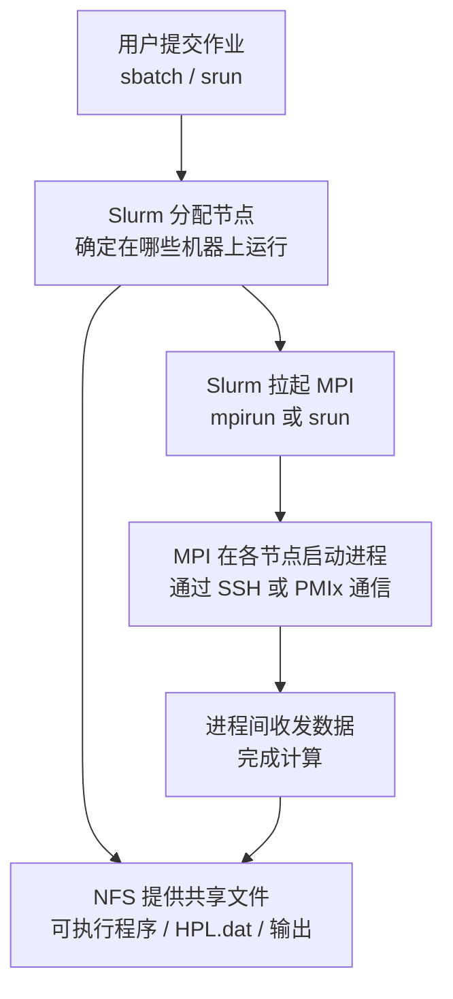
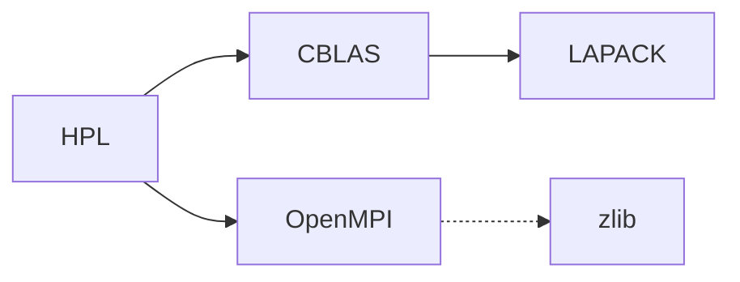
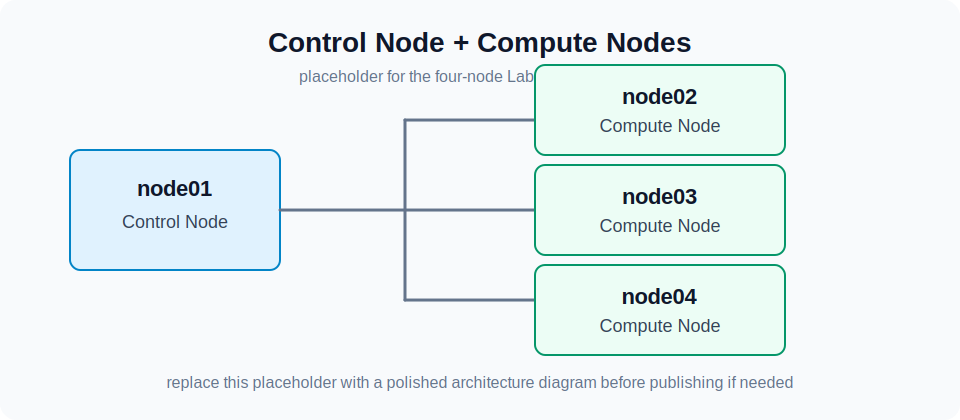
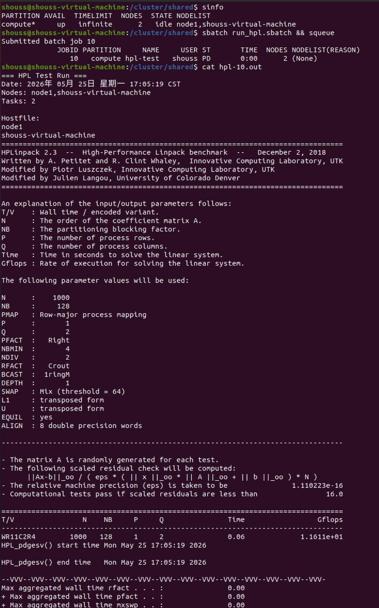

# 实验一：简单集群搭建

!!! warning "仅供参考"

    本文档当前版本为2026年课程的实验文档，仅供参考！
    文档中实验步骤相关命令仅供参考，不要直接复制粘贴！因为这些都依赖于你当前的机器环境，可能会导致你的系统环境乱套。
    

!!!warning "关于Agent"
    
    当前Agent对于系统环境搭建的活已经非常熟悉了，在我们的测试下，他们可以在很短的时间内完成Lab1实验内容.
    当然，我们希望你在实验中充分使用Agent工具，但是不要把Agent当成你的牛马员工，所有事情给他干，你至少需要知道你在做什么。
    在自己的脑海中构建起一个完整的知识架构，远比背下各种奇奇怪怪的命令行要重要。

## 导言：计算机集群

在 Lab 0 中，我们已经获得了 Linux 虚拟机环境，熟悉了 Linux 命令行的基本操作，对 Linux 系统的文件路径、用户权限、环境变量等基本概念有了一定的了解。在接下来的实验中，这些基础知识将会被广泛应用。

本次实验或许是你第一次接触到计算机集群。所谓计算机集群，就是将多台计算机连接在一起，通过网络协同工作，以完成一些大规模的计算任务。为什么我们需要计算机集群呢？因为单体的制造成本和性能是有限的。制造芯片时，人们想把单个处理器的性能提升到极致，但是遇到了物理限制：一块集成电路上的晶体管数量越多，设计就越复杂，发热就越严重，功耗就越大，性能就越低。因此，人们开始尝试将多个处理器连接在一起，就有了现代多核处理器。制造计算机时，也可以放置多个 CPU（常见的服务器一般都具有两颗），但放置更多只会增加单台计算机的设计和制造难度。与其想着怎么把单体造强，不如想着怎么把多个单体连接在一起，怎么让它们协同工作，这就是并行计算思想的由来。

## 实验内容和要求

本次实验，我们将先从源码构建 OpenMPI、BLAS 和 HPL，然后配置 NFS 共享文件系统和 Slurm 作业调度系统，最后通过 Slurm 提交 HPL 任务进行性能测试，并提交测试结果和实验报告。

!!! tip "如何食用本 Lab"

    本 Lab 有 **知识讲解** 和 **任务** 两部分，其中 **知识讲解** 不需要体现在报告中。

    - 本次实验对基础知识介绍得比较详细，其中蓝色框框是希望你 take home 的知识点，请确保理解。
    - 任务部分需要自行完成，请遵守诚信守则。
    - 和 Lab 0 一样，如果你对这些内容轻车熟路，就不需要阅读知识讲解，直接完成任务即可。

### 提交内容

总的来说，你需要先阅读 **知识讲解** 部分，然后逐个完成 **任务** 部分，并将自己完成的过程记录在实验报告中。你需要提交以下的内容：

1. 使用中文完成的实验报告 PDF 文件，内容至少包括下面的过程:
    - 集群概况：说明你的节点数量、节点角色、IP 地址、操作系统、CPU/内存配置、网络连接方式、共享目录和 Slurm 分区。
    - 软件编译：下载 OpenMPI、BLAS 和 HPL 的源代码并编译安装。
    - NFS 配置：准备多节点环境，搭建 NFS 服务器和客户端，使所有节点能够访问同一个共享目录，并给出读写验证结果。
    - Slurm 配置：搭建一个可用的 Slurm 集群，至少包含一个控制节点和一个计算节点，验证 `sinfo`、`srun`、`sbatch` 的结果。
    - HPL 作业提交：通过 Slurm 提交 HPL 任务，记录 Slurm 作业脚本、HPL 输出和性能结果。
    - Bonus：如果完成 k3s，请记录节点加入、Pod/Deployment 运行和服务访问的验证结果。
2. HPL 输出结果文本文件
3. Slurm 作业脚本和对应的输出文件。
4. 如果修改了代码，请提交修改后的代码和一份修改说明。

如果有其他较长的纯文本形式的代码或者配置文件，无需包含在实验报告正文中，可以和 HPL 结果文件一样，作为附件提交。

!!! tip "如何写一份好的实验报告"

    1. 包含以下基本内容：
        - 实验环境：软硬件的细微差别也有可能导致实验过程和结果产生较大差异，因此记录实验环境是非常重要的。这包括宿主机硬件情况，操作系统版本，所使用的 Hypervisor 种类，虚拟机的硬件配置以及网络配置。
        - 实验过程：实验手册已经给出了详细步骤，因此这一部分你不需要再赘述，只需要给出关键截图证明你按步骤完成了即可。我们希望看到的是你在实验过程中遇到了哪些问题，以及你是如何解决的。
        - 实验结果及分析：对于希望你照做的实验（比如本次实验），本就有一个标准的结果，不需要进行分析。但如果是需要你自己设计的实验，那么你需要对实验结果进行分析，解释为什么会得到这样的结果。
    2. 详略得当。一般来说，下面这两种实验报告都不是好的实验报告：
        - 长达数十页的报告：贴满截图和源代码，正文内容却很少。
        - 简陋的实验报告：只有几张截图，没有有效的解释。

!!! warning "注意事项"

    这些注意事项来源于历年同学们的常见问题，希望你能够避免：

    - 不要滥用 `root` 用户，尽量使用普通用户进行操作。在需要权限的时候使用 `sudo`，这能够提醒你谨慎操作。也不要频繁在 `root` 用户和普通用户之间切换，除非你明白自己在做什么，否则只会让两边环境都变乱。在 `root` 用户下工作与普通用户有诸多细微不同，也很容易破坏环境，下面就是一个例子：

    <center>{ width=50% }</center>

    - 理解工作目录和家目录这两个目录。工作目录是你当前所在的目录，家目录是你登录时所在的目录。工作目录与程序在哪无关，与你现在在哪有关。很多程序默认在工作目录下寻找文件（比如 HPL）。如果你在 `/dir` 下运行它，而配置文件在 `/home/user` 下，那么程序就会找不到配置文件。在运行 MPI 时，也要注意工作目录的问题。

## 知识讲解：从源码构建 Linux 应用 - 以 Angband 为例

!!! tip "前置知识"

    掌握 Lab 0 中的内容：Linux 命令行基本操作、软件包管理、用户、文件系统、文件权限。

!!! tip "学习目标"

    这一部分的学习目标是了解如何从源代码构建并安装 Linux 应用。这是一个非常基础的操作，但在实际的软件开发和运维中经常会遇到。我们强烈推荐动手跟着尝试一下，但如果时间紧张，也请详细阅读文档展示的过程并理解知识。我们希望这部分的讲解能够有助于你完成后续 OpenMPI 等软件的构建和安装。

    **这一部分不需要体现在报告中。**

日常使用电脑时，你安装软件的流程一般是：去网上搜索 -> 下载安装包 -> 点击安装 -> 完成，这是因为 Windows / macOS 用户的设备架构统一，并且依赖库比较完备，所以二进制文件基本通用，只要别人替你编译好就能够直接运行。而在 Linux 生态中，使用者的 CPU 架构以及其他硬件和软件配置极其多样。比如在 Lab0 中，或许你已经在 [这个页面](https://mirrors.zju.edu.cn/debian-cd/current/) 见到过 Debian 为相当多的指令集发布了 ISO，例如：

- **amd64**：也称为 x86-64 或 x64，是 64 位 x86 指令集架构。它是 Intel 和 AMD 64 位处理器的通用指令集架构。这种架构通常用于个人计算机、服务器和工作站等通用计算设备上。
- **arm64**：也称为 AArch64，是 ARMv8-A 及其之后架构的 64 位指令集。它设计用于移动设备、嵌入式系统和服务器等多种用途的设备上，具有较低的功耗和更好的性能。
- **i386**：也称为 x86 或 IA-32，是 Intel 32 位 x86 指令集架构。它是早期个人计算机和服务器的常见架构，现在仍然在一些老旧的设备和系统中使用。

我国自研的龙芯 LoongArch、近年来很火的 RISC-V 等架构也在逐渐普及，并即将在 Debian 13 得到官方支持。

由此可见，面对如此多样的指令集结构，软件开发者想要为每一种架构都编译一份软件包十分困难。因此，在 Linux 生态中，源代码是最通用的软件分发形式。

!!! note "在 Linux 生态中，源代码是最通用的软件分发形式。"

在该部分，我们将以 [Angband](https://rephial.org/)（一个开源的 ASCII 地牢猎手游戏）为例，学习如何从源代码构建软件包，并解决构建过程中可能遇到的问题。

### 软件包源码的组织方式

进入 [Angband](https://rephial.org/) 的网站，点击 Source Code，下载最新的源代码压缩包并解压。

```bash
wget https://github.com/angband/angband/releases/download/4.2.5/Angband-4.2.5.tar.gz
tar xvf Angband-4.2.5.tar.gz
cd Angband-4.2.5
ls
```

!!! tip "如果你在下载时遇到了问题"

    你的虚拟机可能因为网络问题连不上 GitHub。此时可以在宿主机下载好，然后通过 `scp` 命令传输到虚拟机中。
    当然你也可以自行探索虚拟机网络配置，自由探索的结果可以写入你的报告里。

!!! note "熟悉开源软件源代码的目录结构"

    一般的开源软件包源码的目录结构如下所示：

    ```text
    .
    ├── bin：存放软件包的可执行文件（binary）。
    ├── src：存放软件包的源代码文件（source）。
    ├── lib：存放软件包的库文件（libraries）。
    ├── docs：存放软件包的文档文件，可能包括用户手册、API文档等。
    └── README.md：包含软件包的说明文档，通常包括软件包的简要介绍、安装指南和使用说明。
    ```

    通常在目录的顶层有一个 README 文件，这就是该软件包的说明书，通常包含：

    - 该应用程序的简介。
    - 依赖性：你需要在你的系统上安装其他什么的软件，以便这个应用程序能够构建和运行。
    - 构建说明：你构建该软件所需要采取的明确步骤。偶尔，他们会在一个专门的文件中包含这些信息，这个文件被直观地称为 INSTALL。

查看 `README.md` 文件，我们发现 Angband 的维护者给出了在线说明的链接，描述了如何编译代码。跟随 compile it yourself 的链接前往网站，查看 Linux 章节的 Native builds 小节。你能找到构建 Angband 的命令吗？

??? success "Check your answer"

    ```bash
    ./configure --with-no-install
    make
    ```

    网站上还描述了依赖性：“有几个不同的可选构建的前端（GCU、SDL、SDL2 和 X11），你可以使用诸如 --enable-sdl，--disable-x11 的参数配置。” 目前这可能对你来说看起来像天书，但你经常编译代码后就会习惯。

    Angband 非常灵活，无论是否有这些可选的依赖，都可以进行编译，所以现在，假装没有额外的依赖。

执行它们，如果遇到错误，尝试解决。在下面的自动化构建工具一节，我们将解释这些命令。

!!! question "帮帮我！"

    有位同学在运行 `./configure` 时遇到了这样的错误：

    ```text hl_lines="11"
    checking build system type... aarch64-unknown-linux-gnu
    checking host system type... aarch64-unknown-linux-gnu
    checking for a BSD-compatible install... /usr/bin/install -c
    checking for sphinx-build... no
    checking for sphinx-build3... no
    checking for sphinx-build2... no
    checking for cc... no
    checking for gcc... no
    checking for clang... no
    configure: error: in `/home/user/Angband-4.2.5':
    configure: error: no acceptable C compiler found in $PATH
    See`config.log' for more details
    ```

    请问这位同学应该怎么做？

    ??? success "答案"

        这位同学需要安装 C 编译器。在 Debian 发行版中，你可以通过 [Debian 搜索软件包](https://packages.debian.org/index) 搜索你需要的软件包，也可以直接在互联网搜索。在这里，我们常用 `gcc` 作为 C 编译器，如果你想要更多的编译器，还可以安装 `build-essential` 软件包，它包含了全面的编译器和构建工具。

        ```bash
        sudo apt update
        sudo apt install build-essential
        ```

        然后再次运行 `./configure`。

正确执行完成后，你会在 `src` 目录下找到 `angband` 可执行文件。尝试运行它，看看你能否看到游戏界面。

```bash
src/angband
```

### 令人头疼的依赖关系与链接库

!!! note "链接"

    实际的工程开发中，采用的一定是多文件编程: 编译器将每个代码文件分别编译后，还需要将它们合在一起变成一个软件，**合在一起的过程就是链接的过程**。这些内容在 C 语言课程中应该会覆盖到，但如果你没有学过，也不用担心，可以学习一下翁恺老师的 [智云课堂](https://classroom.zju.edu.cn/livingroom?course_id=53613&sub_id=1028201&tenant_code=112) 或者 [MOOC](https://www.icourse163.org/course/ZJU-200001) (第五周) 中对大程序结构的详细介绍。

    链接分为静态链接和动态链接。静态链接是指在编译时将库文件的代码和程序代码合并在一起，生成一个完全独立的可执行文件。动态链接是指在程序运行时，加载库文件，从而节省存储空间，提高程序的复用性和灵活性。

    - 静态链接
        - 如果你的程序与静态库链接，那么链接器会将静态库中的代码复制到你的程序中。这样，你的程序就不再依赖静态库了，可以在任何地方运行。但是，如果静态库中的代码发生了变化，你的程序并不会自动更新，你需要重新编译你的程序。
        - 在 Linux 系统上，静态库的文件名以 `.a` 结尾，比如 `libm.a`。在 Window 上，静态库的文件名以 `.lib` 结尾，比如 `libm.lib`。静态库可以使用 `ar` （archive program）工具创建。
    - 动态链接
        - 当你的程序与动态库链接时，程序中创建了一个表。在程序运行前，操作系统将需要的外部函数的机器码加载到内存中，这就是动态链接过程。
        - 与静态链接相比，动态链接使程序文件更小，因为一个动态库可以被多个程序共享，节省磁盘空间。部分操作系统还允许动态库代码在内存中的共享，还能够节省内存。动态库升级时，也不需要重写编译你的程序。
        - 在 Linux 系统上，动态库的文件名以 `.so` 结尾，比如 `libm.so`。在 Window 上，动态库的文件名以 `.dll` 结尾，比如 `libm.dll`。

    动态链接具有上面描述的优点，因此一般程序会尽可能地执行动态链接。

    链接相关的问题可能出现在链接时（静态链接）、程序运行前和运行中（动态链接）。下面是一些常见的问题。

    [cards(docs/lab/Lab1-MiniCluster/link.json)]

如果你的虚拟机之前没有安装过相关软件包，那么你大概率无法成功看到游戏界面，它什么输出都没有就退出了。

```bash
user@debian:~/Angband-4.2.5$ src/angband
user@debian:~/Angband-4.2.5$
```

回看刚刚 `./configure` 的输出，它其实给出了警告：

```text hl_lines="13 24"
Configuration:

  Install path:                           (not used)
  binary path:                            (not used)
  config path:                            /home/user/Angband-4.2.5/lib/
  lib path:                               /home/user/Angband-4.2.5/lib/
  doc path:                               (not used)
  var path:                               /home/user/Angband-4.2.5/lib/
  gamedata path:                          /home/user/Angband-4.2.5/lib/
  documentation:                          No

-- Frontends --
- Curses                                  No; missing libraries
- X11                                     No; missing libraries
- SDL2                                    Disabled
- SDL                                     Disabled
- Windows                                 Disabled
- Test                                    No
- Stats                                   No
- Spoilers                                Yes

- SDL2 sound                              Disabled
- SDL sound                               Disabled
configure: WARNING: No player frontends are enabled.  Check your --enable options and prerequisites for the frontends.
```

搜索一下 `ncurses` 库，你会了解到它是一个用于在 UNIX-like 系统上进行文本界面操作的库。它提供了一套 API，使得开发者能够在终端上创建和管理文本界面应用程序，包括窗口、菜单、对话框、文本输入等功能。Angband 使用了了 `ncurses` 库来实现游戏界面。但这个库不会被包含在 Angband 的源代码中，也没有默认包含在系统中，因此我们需要手动安装。通过网络搜索，我们得知 `ncurses` 库包含在 `libncurses5-dev` 软件包中，我们可以通过下面的命令安装它：

```bash
sudo apt install libncurses5-dev
```

安装完成后再次运行 `./configure`，它应当能够识别到 `ncurses` 库：

```text hl_lines="2"
-- Frontends --
- Curses                                  Yes
```

再次运行 `make`，运行生成的 `src/angband`，你应当能够看到游戏界面了。

<figure markdown="span">
{ width=80% }
<figcaption>Angband 游戏界面</figcaption>
</figure>

在刚刚的过程中，我们解决了一个简单的依赖问题：Angband -> ncurses。在 HPC 应用中，实际的依赖关系极其复杂：

<figure markdown="span">

<figcaption>大型软件的依赖关系<br /><small>来源：<a href="https://spack-tutorial.readthedocs.io/en/sc21/_static/slides/spack-sc21-tutorial-slides.pdf">Managing HPC Software Complexity with Spack</a></small></figcaption>
</figure>

别担心，接下来的自动化工具和包管理器会帮你解决一切问题<del>（当然也可能产生一堆问题）</del>。

!!! note "What we have learnt"

    - 留意 `./configure` 的输出，它一般负责检查系统环境是否满足软件包的依赖。
    - 使用 `apt` 安装缺失的库。

### 不怎么自动的自动化构建工具

在上面的例子中，我们使用了 `./configure` 和 `make` 来构建软件包，它们就是 GNU Autotools 构建系统的一部分。如果没有它们，我们就需要手动写一行行命令、检查系统配置是否满足要求、使用编译器来编译源代码、链接器来链接目标文件，这是一项非常繁琐的工作。

!!! note "自动化构建工具简介"

    自动化构建工具（Automated Build Tools）是用于自动化软件构建过程的工具，它们可以自动执行编译、链接、测试和部署等一系列操作，从而减少手动操作，提高软件开发的效率和质量。

    自动化构建工具的主要功能包括：

    - **编译和链接**：自动化构建工具可以自动执行源代码的编译和链接操作，生成可执行文件、共享库或其他目标文件。
    - **依赖管理**：在构建过程中，自动化构建工具可以检测源代码文件之间的依赖关系，并且只重新构建发生变化的文件，从而加快构建速度。
    - **代码检查**：自动化构建工具可以集成代码静态分析和代码风格检查工具，帮助开发者发现潜在的代码问题并提出改进建议。
    - **单元测试**：自动化构建工具可以自动运行单元测试，并生成测试报告，帮助开发者确保代码的质量和稳定性。
    - **打包和部署**：自动化构建工具可以自动将构建好的软件打包成可分发的安装包，并且自动部署到指定的环境中。

    自动化构建工具的出现主要是为了解决软件开发过程中的重复性、繁琐性和容易出错的问题。通过自动化构建工具，开发者可以将重复性的任务交给计算机自动执行，节省了大量的时间和精力。同时，自动化构建工具可以提高软件构建的一致性和可重复性，减少了由于人为操作而引入的错误，提高了软件的质量和稳定性。因此，自动化构建工具已经成为现代软件开发过程中不可或缺的一部分。

学习使用自动化构建工具、理解它的工作原理并在使用中解决它遇到的错误是一个比较痛苦的过程，但它相比原始的手动构建过程，能够大大提高软件开发的效率。下面的两张 PPT 把这一原因解释得很清楚：即使 Autotools 很老、很难用、人们厌恶它，但它提供了一套标准的解决方案，能够在大部分项目中通用。Learn once, use everywhere。

<figure markdown="span">

<figcaption>即使人们厌恶它，但仍然在使用自动化构建工具<br /><small>来源：<a href="https://elinux.org/images/4/43/Petazzoni.pdf">GNU Autotools: A Tutorial</a></small></figcaption>
</figure>

现在，让我们简单了解一下常见的两种构建工具的使用方法。

!!! note "GNU Autotools"

    GNU Autotools 是一套用于自动化软件构建的工具集，包括 Autoconf、Automake 和 Libtool。它们可以帮助开发者在不同的操作系统和编译器上构建软件包，提供了一种跨平台的构建解决方案。

    - **Autoconf**：Autoconf 是一个用于生成配置脚本的工具，它可以根据系统环境和用户选项生成一个可移植的配置脚本，用于检查系统环境、生成 Makefile 和配置头文件等。
    - **Automake**：Automake 是一个用于生成 Makefile 的工具，它可以根据 Makefile.am 文件生成标准的 Makefile 文件，用于编译和链接源代码。
    - **Libtool**：Libtool 是一个用于管理库文件的工具，它可以处理库文件的版本号、共享库和静态库的生成、链接和安装等操作。

    GNU Autotools 的工作流程一般是：首先使用 Autoconf 生成 configure 脚本，然后使用 configure 脚本生成 Makefile 文件，最后使用 Makefile 文件编译和链接源代码，生成可执行文件或库文件。写成命令就是：

    ```bash
    ./configure
    make
    make install
    ```

    流程中的每一个环节都可以根据需要进行定制。如下图：

    <figure markdown="span">
    
    <figcaption>GNU Autotools 的工作流程<br /><small>来源：[GNU Autotools: A Tutorial](https://elinux.org/images/4/43/Petazzoni.pdf)</small></figcaption>
    </figure>

    要如何修改这些文件，应当阅读项目文档如 `README` 和 `INSTALL` 等文件。有时，也可以通过为这些命令添加参数来修改行为。

回看 Angband 最开始的软件包内容，你会发现其中只有 `./configure`，没有 `Makefile`。`Makefile` 是在你运行 `./configure` 后生成的。在接下来的任务部分，你也会遇到无需 `./configure` 而是需要修改 `Makefile` 的情况。总之，GUN Autotools 提供的是一个高度可自定义的框架，具体怎么使用一定要阅读软件包的文档。

!!! note "CMake"

    CMake 是一个更加现代化的开源的跨平台的构建工具。它使用一种类似于脚本的语言来描述构建过程，然后根据这个描述生成相应的构建文件。与 GNU Autotools 相比，它提供了更多的功能，与更多的现代软件如 IDE 实现了集成，因此在一些项目中取代了 Autotools。但编写 `CMakeLists.txt` 也比 `Makefile` 更为抽象，理解和使用难度也更大。但是在当前的Agent时代，我们可以让LLM帮我们审查长而复杂的`CMakeLists.txt`。

    <figure markdown="span">
    { width=50% }
      <figcaption>CMake 的优势是跨平台<br /><small>来源：[Why Using CMake - Riccardo Loggini](https://logins.github.io/programming/2020/05/17/CMakeInVisualStudio.html)</small></figcaption>
    </figure>

    CMake 的另一大优势是缓存。CMake 会在第一次运行时生成一些缓存文件，这个文件记录了所有的配置信息，包括编译器、编译选项、依赖库等。这样，当你修改了源代码后，只需要重新运行 CMake，它就会根据缓存文件重新生成构建文件，而不需要重新进行检查、配置和生成。对于大型项目的增量开发和构建来说，这极大地节约了时间。

    CMake 的工作流程一般是：首先编写 CMakeLists.txt 文件，描述项目的目录结构、源代码文件、依赖库等信息，然后使用 CMake 工具生成构建文件，最后使用构建工具（如 make、ninja 等）编译和链接源代码，生成可执行文件或库文件。对应的命令如下：

    ```bash
    cmake -B build
    cmake --build build
    ```

Angband 也提供了 CMake 的构建方式。查看 Angband 在线文档，你能找到使用 CMake 构建以 GCU 为前端的命令吗？

??? success "Check your answer"

    ```bash
    mkdir build && cd build
    cmake -DSUPPORT_GCU_FRONTEND=ON ..
    make
    ```

你应该能看到 `Angband` 程序直接生成在该目录下，同时 `lib` 等必要的目录也被拷贝了一份。这种构建方式不会污染源代码目录，是一种比较好的实践。

## 知识讲解：集群环境搭建与配置

!!! tip "前置知识"

    掌握 Lab0 中的内容：虚拟机、网络、SSH。

### 集群节点间的连接与互访

计算机之间通过网络连接。在网络中，有两个重要的地址：MAC 地址和 IP 地址。通过 Lab 0 的学习，你应该理解了这两种地址如何通过 ARP 协议联系在一起，也理解了虚拟机中的 NAT 网络。做任务时，你需要克隆虚拟机。克隆出来的新虚拟机的 MAC 地址与原来的虚拟机相同。思考一下，如果同时启动这两台虚拟机，它们能正常通信吗？你可以参考 [Duplicate MAC address on the same LAN possible? - StackExchange](https://serverfault.com/questions/462178/duplicate-mac-address-on-the-same-lan-possible)。

[计算机集群（Cluster）](https://en.wikipedia.org/wiki/Computer_cluster)是连接在一起、协同工作的一组计算机，集群中的每个计算机都是一个节点。在集群中，由软件将不同的计算任务（task）分配（schedule）到相应的一个或一群节点（node）上。通常会有一个节点作为主节点（master/root node），其他节点作为从节点（slave node）。主节点负责调度任务（当然也可能负责执行部分任务），从节点负责执行任务。此外，也通常会有一个共享的文件系统，用于存储任务数据和结果。这些技术会在后面的 NFS 和 Slurm 小节中介绍。

<figure markdown="span">

<figcaption>计算机集群的协作<br /><small>来源：<a href="https://www.geeksforgeeks.org/an-overview-of-cluster-computing/">An Overview of Cluster Computing - GeeksforGeeks</a></small></figcaption>
</figure>

在 Lab 0 中，我们已经学习了如何通过 SSH 使用密码访问虚拟机。在集群中，节点之间的互访往往也通过 SSH 完成，但要求无交互（non-interactive）。想要实现无需输入密码就能互相认证，就需使用 SSH 的密钥认证（key-based authentication）。

SSH 密钥认证基于密码学中的非对称加密算法。在 SSH 密钥认证中，用户有两个密钥：私钥（private key）和公钥（public key），它们一一配对：用私钥加密的数据，只有用对应的公钥才能解密，同理，用公钥加密的数据，只有用对应的私钥才能解密。**私钥只有用户自己知道，公钥可以公开**。

所谓配置 SSH 密钥认证，就是让服务器信任该公钥，允许持有该私钥的用户连接。(对这一过程感兴趣的同学，可以阅读下面的简单介绍。)

???- note "SSH 密钥认证的原理"

    用户可以将公钥放在服务器上，当用户连接服务器时，服务器会用公钥加密一个随机数发送给用户，用户用私钥加密这个随机数，然后用这个随机数加密数据发送给服务器，服务器用公钥解密数据。根据非对称加密的原理，如果用户能够成功加密，则说明用户拥有该私钥，这样就验证了用户的身份，连接可以成功建立。

    <figure markdown="span">
    { style="background-color: white;" }
    <figcaption>SSH 密钥认证<br /><small>来源：[How SSH encrypts communications, when using password-based authentication? - StackOverflow](https://stackoverflow.com/questions/59555705/how-ssh-encrypts-communications-when-using-password-based-authentication)</small></figcaption>
    </figure>

在集群中，我们需要在主节点中生成密钥对，将主节点的公钥放在从节点上，这样主节点就能够通过 SSH 密钥认证连接到从节点。你可以阅读 [How To Configure SSH Key-Based Authentication on a Linux Server - DigitalOcean](https://www.digitalocean.com/community/tutorials/how-to-configure-ssh-key-based-authentication-on-a-linux-server) 了解如何配置 SSH 密钥认证。基本操作如下：

```bash
ssh-keygen -t ed25519 # 生成密钥对，使用 ed25519 算法 (强烈推荐)
ssh-copy-id user@hostname # 将公钥放在服务器上
```

需要注意的是，认证基于用户。不是说主节点可以连接到从节点，而应当说主节点上的某个用户可以连接到从节点上的某个用户。如果在主节点上为 `root` 用户生成密钥对，却在从节点上将公钥放置进 `test` 用户的 `.ssh/authorized_keys` 文件中，那么显然无法以密钥认证的方式登录到从节点的 `root` 用户。

### MPI: 一个程序如何在不同机器间通信

MPI 指的是 [Message Passing Interface](http://www.mpi-forum.org/)，是程序在不同机器间发送、接收数据的接口标准，类似于定义了一套通信的 API。它被设计用于支持并行计算系统的架构，使得开发者能够方便地开发可移植的消息传递程序。MPI 编程能力在高性能计算的实践与学习中也是非常基础的技能。

而 OpenMPI 是一个开源的 MPI 标准的实现，由一些科研机构和企业一起开发和维护。在接下来的任务中，我们需要编译安装 OpenMPI。

`mpirun` 是 OpenMPI 提供的 MPI 启动程序，负责在指定的节点上启动 MPI 程序，此后程序间的通信由 MPI 库负责。可以为 `mpirun` 指定参数，比如启动的进程数、启动的节点等。阅读 [10.1. Quick start: Launching MPI applications - OpenMPI main documentation](https://docs.open-mpi.org/en/main/launching-apps/quickstart.html) 和 [10.6. Launching with SSH - OpenMPI main documentation](https://docs.open-mpi.org/en/main/launching-apps/ssh.html)，了解如何使用 `mpirun` 通过 SSH 的方式启动 OpenMPI 程序，如何指定启动的节点和进程数，如何指定工作路径。

!!! question "回答以下问题"

    - 如何为 `mpirun` 指定节点和进程数？
    - 如何为 `mpirun` 指定工作路径？
    - 如果不指定工作路径，`mpirun` 会在哪个路径启动程序？如何验证你的答案。

    ??? success "Check your answer"

        - 一般使用 `--hostfile` 和 hostfile 一起指定节点和进程数。OpenMPI 的 hostfile 的格式如下：

            ```text title="hostfile"
            node1 slots=4
            node2 slots=4
            ```

            这个 hostfile 描述了有两个节点的集群，每个节点使用 4 个核心。

        - 使用 `--wdir` 指定工作路径。如果未指定，尝试 `mpirun` 执行时的工作路径。若路径不存在，为 `$HOME`。你可以通过 `mpirun ls` 来尝试验证。

!!! note "使用 `mpirun` 在集群中运行 MPI 程序，可以指定节点、进程数和工作路径等。"

!!! warning "使用 `mpirun` 在多节点运行程序时，需要配置各计算节点之间的 SSH 免密登录"

### NFS: 集群如何共享文件

在前面的 `mpirun` 例子中，MPI 只负责启动进程和进程间通信，不负责帮你分发可执行文件、输入文件或输出目录。如果你在 `node01` 的 `~/hpl-2.3/bin/Linux_PII_FBLAS` 中运行 `mpirun --hostfile hostfile ./xhpl`，其他节点也必须能在相同路径找到 `xhpl` 和 `HPL.dat`。否则，MPI 进程可能会在远端节点启动失败，或者因为找不到配置文件而退出。

解决这个问题的一种朴素方法是手动把同一份目录复制到每个节点。但真实集群通常不会这样管理用户文件，而是使用共享文件系统。NFS（Network File System）就是一种常见的网络文件系统：一个节点导出目录，其他节点通过网络挂载它。挂载完成后，客户端访问这个目录就像访问本地目录一样。

在本 Lab 中，`node01` 将作为 NFS 服务器，导出 `/cluster/shared`；`node02`、`node03`、`node04` 将作为 NFS 客户端，把同一个远程目录挂载到本地的 `/cluster/shared`。这样你只需要把 HPL 可执行文件、`HPL.dat` 和 Slurm 作业脚本放到这个共享目录中，所有节点都能看到同一份内容。

NFS 对初学者最容易出问题的是权限。Linux 文件权限最终依赖数字 UID/GID，而不是只看用户名字符串。如果 `node01` 上的 `user` 是 UID 1000，但 `node02` 上的 `user` 是 UID 1001，那么 NFS 客户端看到的文件属主就可能和你预期不一致。（任务二中有一个专门的框框讲 UID/GID，可以跳过去看看。）因此，搭建 NFS 前应确保实验用户在所有节点上的用户名、UID、GID 一致。

实际维护集群时，还需要继续关注一些 NFS 配置细节：`/etc/exports` 中的导出范围不应过大，避免把共享目录暴露给不可信网段；`root_squash`、只读导出、客户端网段限制等选项会影响安全性和可维护性；`/etc/fstab` 可以实现开机自动挂载，但网络未就绪时可能导致挂载失败，必要时可以了解 autofs。NFS 适合入门和中小规模共享目录；更大规模集群可能会使用 Lustre、CephFS 等文件系统。

!!! note "NFS 解决的是共享文件问题"

    NFS 不能替代 MPI，也不能替代 Slurm。MPI 负责并行程序通信，Slurm 负责任务调度和资源分配，NFS 负责让各节点访问同一份文件。

### Slurm: 集群如何调度作业

直接使用 `mpirun --hostfile` 可以帮助你理解 MPI 如何在多个节点上启动程序，但真实 HPC 集群通常不会让用户随意 SSH 到节点并手工启动计算任务。原因很简单：集群资源是共享的，需要有系统控制谁能使用哪些节点、什么时候运行、每个任务能用多少 CPU/内存/时间，以及任务运行结果如何记录。

Slurm 是 HPC 集群中常见的作业调度系统。参考 [Slurm Quick Start User Guide](https://slurm.schedmd.com/quickstart.html)，它主要提供三类能力：

- 控制用户对计算节点的访问。
- 提供并行任务执行框架。
- 提供任务调度和队列。

理解 Slurm 时需要先区分几个基本概念：

- 节点（node）：一台可以参与计算的机器，例如 `node02`。
- 分区（partition）：一组节点构成的队列，例如本 Lab 中的 `debug` 分区。
- 作业（job）：用户提交给 Slurm 的一次计算请求。
- 作业步骤（step）：作业内部的一次实际运行，例如一个 `srun hostname` 或一个 MPI 程序启动。

常用命令包括：

- `sinfo`：查看分区和节点状态。
- `srun`：直接启动一个并行任务，常用于快速测试或交互式运行。
- `sbatch`：提交批处理脚本，让作业进入队列并由 Slurm 调度运行。
- `squeue`：查看当前排队或运行中的作业。
- `sacct`：查看历史作业记录。是否可用取决于是否配置了 accounting。

一个典型的 `sbatch` 脚本会在文件开头用 `#SBATCH` 指定资源需求，例如作业名、分区、节点数、任务数、每个任务使用的 CPU 数和输出文件路径。下面是一个简化示例：

```bash
#!/bin/bash
#SBATCH --job-name=hpl
#SBATCH --partition=debug
#SBATCH --nodes=2
#SBATCH --ntasks-per-node=1
#SBATCH --cpus-per-task=1
#SBATCH --output=/cluster/shared/%x-%j.out

cd /cluster/shared/hpl-2.3/bin/Linux_PII_FBLAS
mpirun ./xhpl
```

其中 `%x` 会被替换为作业名，`%j` 会被替换为作业 ID。这类输出文件命名方式可以避免多次提交时互相覆盖。

!!! warning "Slurm 申请的资源会影响程序实际运行方式"

    如果提交作业时没有正确指定 `--nodes`、`--ntasks`、`--ntasks-per-node`、`--cpus-per-task` 等参数，程序可能只使用到很少的资源。运行 HPL 时，还需要让 `HPL.dat` 中的 `P * Q` 与实际 MPI 进程数一致。

#### MPI、Slurm、NFS 三者如何协作

这三个组件常被初学者混淆，但它们的分工非常清晰：

| 组件 | 职责 | 类比 |
|------|------|------|
| **MPI** (OpenMPI) | 进程间通信：让不同机器上的程序能互相发送/接收数据 | 快递员（负责送货） |
| **Slurm** | 资源调度：决定哪些节点运行任务、何时运行、分配多少资源 | 物流调度中心（决定谁来送、送到哪） |
| **NFS** | 共享文件系统：让所有节点看到同一份文件（可执行文件、输入数据、输出结果） | 共享仓库（所有人取同一份货） |

三者协作流程如下：



没有 Slurm 也可以直接用 `mpirun --hostfile` 运行 MPI 程序。那还要 Slurm 干什么？试想一个集群上有几十个用户、几百个节点，全都手工 `mpirun` 抢资源——马上就会打起来。Slurm 解决的就是**排队管理、资源隔离和记账审计**的问题。

<!-- TODO: mpi_slurm_relation.webp - MPI/SLURM/NFS 协作架构图 -->

#### 两种启动方式对比

| 方式 | 命令 | 适用场景 | 说明 |
|------|------|----------|------|
| 直接 `mpirun` | `mpirun --hostfile hostfile -np 4 ./xhpl` | 调试、测试、小规模验证 | 手动指定节点，不依赖 Slurm |
| 通过 Slurm | `sbatch run.slurm` 或 `srun ./xhpl` | 正式运行、批量作业 | Slurm 自动分配资源并调用 MPI |

在 Slurm 作业中，`srun` 可以自动感知 Slurm 分配的节点和进程数，无需手工写 hostfile。但如果你使用的 OpenMPI 没有编译 Slurm/PMIx 支持，也可以在 `sbatch` 脚本中手动构建 hostfile 再调用 `mpirun`：

```bash
#!/bin/bash
#SBATCH --nodes=2
#SBATCH --ntasks=2

# 从 Slurm 环境变量生成 hostfile
scontrol show hostnames $SLURM_NODELIST > /tmp/hostfile
mpirun -np 2 --hostfile /tmp/hostfile ./xhpl
```

### 性能测试 Benchmark

[HPL](https://www.netlib.org/benchmark/hpl/)（high performance Linpack）是评测计算系统性能的程序，是早期 [Linpack](https://www.netlib.org/linpack/) 评测程序的并行版本，支持大规模并行超级计算系统。其报告的每秒浮点运算次数（floating-point operations per second，简称 FLOPS）是世界超级计算机 Top500 列表排名的依据。

BLAS 是 Basic Linear Algebra Subprograms 的缩写，是一组用于实现基本线性代数运算的函数库。HPL 使用 BLAS 库来实现矩阵运算，因此需要 BLAS 库的支持。

!!! note "HPL 通过求解线性系统来评估计算机集群的浮点性能"

如果你对 HPL 的算法细节感兴趣，可以展开阅读下面的内容。

???- note "HPL 的算法细节"

    HPL 算法使用 64 位浮点精度矩阵行偏主元 LU 分解加回代求解线性系统。矩阵是稠密实矩阵，矩阵单元由伪随机数生成器产生，符合正态分布。

    线性系统定义为：

    $$
    Ax=b; A\in R^{N\times N}; x, b \in R^N
    $$

    行偏主元 LU 分解 $N×(N+1)$ 系数矩阵 $[A,b]$：

    $$
    P_r[A,b] = [[L\cdot U], y];
    P_r, L, U \in R^{N\times N}; y \in R^N
    $$

    其中，$P_r$ 表示行主元交换矩阵，分解过程中下三角矩阵因子 $L$ 已经作用于 $b$，解 $x$ 通过求解上三角矩阵系统得到：

    $$
    Ux=y
    $$

    HPL 采用分块 LU 算法，每个分块是一个 $NB$ 列的细长矩阵，称为 panel。LU 分解主循环采用 right-looking 算法，单步循环计算 panel 的 LU 分解和更新剩余矩阵。基本算法如下图所示，其中 $A_{1,1}$ 和 $A_{2,1}$ 表示 panel 数据。需要特别说明的是，图示矩阵是行主顺序，HPL 代码中矩阵是列主存储的。

    <figure markdown="span">
    { width=80% }
    <figcaption>分块 LU 算法<br /><small>来源：<a href="https://kns.cnki.net/kcms2/article/abstract?v=qwZretP9BaHvUBwZiPjDpzt_KPtU2PXJSK0YVwCUYeCUQFlgxSAJKvStsXKUQgi7vp0dzvK1lhS5OYFXUgXXdKGZL9ljRGRsbRhmjx411BBN35dOaoxrEhTaj2fwikpGLUS9jtc7unQ=&uniplatform=NZKPT&language=CHS">复杂异构计算系统 HPL 的优化</a></small></figcaption>
    </figure>

    计算公式如下：

    $$
    \begin{aligned}
    \left [\frac{L_{1,1}}{L_{2,1}}, U_{1,1} \right ] &= LU(\frac{A_{1,1}}{A_{2,1}}) \\
    U_{1,2} &= L_{1,1}^{-1}A_{1,2} \\
    A_{2,2}^{update} &= A_{2,2} - L_{2,1}U_{1,2}
    \end{aligned}
    $$

    第 1 个公式表示 panel 的 LU 分解，第 2 个公式表示求解 $U$，一般使用 `DTRSM` 函数，第 3 个公式表示矩阵更新，一般使用 `DGEMM` 函数。

    对于分布式内存计算系统，HPL 并行计算模式基于 MPI，每个进程是基本计算单元。进程组织成二维网格。矩阵 A 被划分为 $NB×NB$ 的逻辑块，以 Block-Cycle 方式分配到二维进程网格，数据布局示例如图所示。

    <figure markdown="span">
    
    <figcaption>进程网格和数据布局<br /><small>来源：<a href="https://kns.cnki.net/kcms2/article/abstract?v=qwZretP9BaHvUBwZiPjDpzt_KPtU2PXJSK0YVwCUYeCUQFlgxSAJKvStsXKUQgi7vp0dzvK1lhS5OYFXUgXXdKGZL9ljRGRsbRhmjx411BBN35dOaoxrEhTaj2fwikpGLUS9jtc7unQ=&uniplatform=NZKPT&language=CHS">复杂异构计算系统 HPL 的优化</a></small></figcaption>
    </figure>

    对于具有多列的进程网格，单步循环只有一列进程执行 panel 分解计算，panel 分解过程中每一列执行一次 panel 的行交换算法选择并通信最大主元行。Panel 分解计算完成后，把已分解数据广播到其他进程列。HPL 基础代码包含 6 类广播算法，可以通过测试选择较优的算法。

    HPL 采用行主元算法，单步矩阵更新之前，要把 panel 分解时选出的最大主元行交换到 $U$ 矩阵中，需要执行未更新矩阵的主元行交换和广播。主元行交换和广播后，每个进程获得完整的主元行数据。

    矩阵更新包括两部分计算，一是使用 `DTRSM` 求解 $U$，二是使用 `DGEMM` 更新矩阵数据。

    LU 分解完成后，HPL 使用回代求解 $x$，并验证解的正确性。

---

知识讲解到此结束。接下来是本次实验的**任务部分**。在开始动手之前，请先阅读下面的「集群概况」，对你将要搭建的集群做一个整体规划。

## 集群概况

在开始具体任务之前，请先规划你的集群结构，并在实验报告中给出一个简洁的集群概况。它不需要很长，但要让读者能快速理解你的实验环境。例如：

| 节点 | 角色 | IP 地址 | CPU / 内存 | 主要服务 |
| --- | --- | --- | --- | --- |
| `node01` | 控制节点 | `192.168.136.130` | 2 vCPU / 4 GiB | NFS server, Slurm controller |
| `node02` | 计算节点 | `192.168.136.131` | 2 vCPU / 4 GiB | NFS client, Slurm compute |
| `node03` | 计算节点 | `192.168.136.132` | 2 vCPU / 4 GiB | NFS client, Slurm compute |
| `node04` | 计算节点 | `192.168.136.133` | 2 vCPU / 4 GiB | NFS client, Slurm compute |

同时说明：

- 使用的操作系统版本和虚拟化 / 容器 / 物理机环境。
- 节点之间如何解析主机名，例如 `/etc/hosts`、DNS 或容器网络。
- NFS 共享目录路径，例如 `/cluster/shared`。
- Slurm 分区名称和节点列表，例如 `debug: node[02-04]`。

## 任务一：从源码构建 OpenMPI、BLAS 和 HPL

!!! note "学习 Makefile 基本语法"

    过程中你会遇到需要修改 `Makefile` 的步骤，因此希望你了解 `Makefile` 的基本语法。这一内容本应在 C 语言课程中完成讲授，不过大部分老师都省略了这部分。所以如果你没有学过，可以参考 [:simple-bilibili: Makefile 20 分钟入门 - 南方科技大学计算机系](https://www.bilibili.com/video/BV188411L7d2)进行学习。

!!! tip "提醒：完成任务时请认真阅读文档，看不懂的地方可以搜索 / 问 GPT / 问助教。"

这几个项目的依赖关系是：



因此，你需要先编译 OpenMPI，BLAS 和 CBLAS，然后再编译依赖他们的 HPL。

zlib 是 OpenMPI 的可选依赖，用于改善数据传输性能，可在构建 OpenMPI 前安装 `zlib1g-dev`。

- 构建并安装 OpenMPI：
    - 前往 [OpenMPI 官网](https://www.open-mpi.org/software/ompi/) 下载最新版本源码。
    - 解压源码，进入源码目录，阅读 `README.md`。
    - 前往在线文档，查看[构建和安装部分](https://docs.open-mpi.org/en/v5.0.x/installing-open-mpi/quickstart.html)，按文档指示构建并安装 OpenMPI。
    - 验证安装是否成功。提示：运行 `ompi_info -all`。
- 构建 BLAS，CBLAS：
    - 下载指定版本 BLAS 源码: `src/lab1/blas-3.12.0.tgz`, 并完成构建。
    - 下载指定版本 CBLAS 源码: `src/lab1/CBLAS.tgz`。相应修改 `Makefile.in` 后完成构建。`我们希望你能解决所有报错。`
    - 如果没有错误，两个目录中都会生成一个 `.a` 文件，这是待会要用到的静态链接库。

<figure markdown="span">
{ width=50% }
</figure>

- 构建 HPL：
    - 前往 [HPL 官网](https://netlib.org/benchmark/hpl/software.html)，下载最新版本源码。
    - 解压源码，进入源码目录，阅读 `README`。
    - 按文档指示构建 HPL。提示：上面的 BLAS 被称为 FBLAS，以与 CBLAS 区分。
    - 如果没有错误，可以按文档中的描述找到 `xhpl` 可执行文件。

!!! warning "不得不品的手动编译"
    在编译安装过程中会出现各种各样的问题，因为某些项目的源代码更新不频繁，可能在新的环境中无法正常编译，这是很常见的现象。
    因此，即使有很多自动化编译安装的方法，我们还是希望你能够亲自动手编译安装这些项目，来积累解决编译失败问题的经验。

    遇到问题时，你可以借助搜索引擎、StackOverflow 以及 AI 工具，尝试解决它们。

    如果你遇到了无法解决的困难，可以参考下面的解答和说明。如果还是无法解决，请向我们反馈。

!!! tip "如果选择 Docker 路线"

    如果你计划使用 Docker 完成实验，可以把任务一的编译过程写进 `Dockerfile`，这样镜像构建时会自动完成所有编译。将编译步骤容器化有几个需要注意的地方：

    - **构建上下文**：BLAS 和 CBLAS 的源码包 `blas-3.12.0.tgz` 和 `CBLAS.tgz` 位于仓库的 `src/lab1/` 下，需要在 `Dockerfile` 中通过 `COPY` 指令引入，或者构建时指定正确的 `context`。
    - **网络问题**：OpenMPI 和 HPL 的源码需要从官网下载。如果构建时网络不稳定，可以考虑在宿主机提前下载好，再用 `COPY` 指令带入镜像。也可以给 Docker 配置镜像加速器或代理。
    - **OpenMPI 的 PATH**：通过 `ENV` 指令设置的 PATH 只在构建过程中生效。容器运行后通过 `su - user` 登录时，`.profile` 不会继承 `ENV` 中的 PATH。需要在 `Dockerfile` 中额外修改 `/home/user/.bashrc` 或 `/etc/profile`，将 `/opt/openmpi/bin` 加入 PATH，否则后面运行 `mpirun` 时会找不到命令。LD_LIBRARY_PATH 同理。
    - **镜像体积**：编译 OpenMPI、BLAS 和 HPL 会产生较大的镜像。可以在一个 `RUN` 指令中完成下载、编译、清理，利用 Docker 的分层缓存机制控制镜像大小。

    ??? success "参考：Dockerfile 中编译 OpenMPI / BLAS / HPL 的关键步骤"

        下面截取了已有 Dockerfile 中的编译部分，供参考（省略了基础环境和 SSH 配置）：

        ```dockerfile
        # ---- OpenMPI ----
        RUN cd /opt/src \
            && wget -q "https://download.open-mpi.org/release/open-mpi/v5.0/openmpi-5.0.3.tar.gz" \
            && tar xf "openmpi-5.0.3.tar.gz" \
            && cd "openmpi-5.0.3" \
            && ./configure --prefix=/opt/openmpi \
            && make -j"$(nproc)" \
            && make install \
            && echo /opt/openmpi/lib >/etc/ld.so.conf.d/openmpi.conf \
            && ldconfig

        # ---- BLAS ----
        RUN cd /opt/src \
            && tar xf blas-3.12.0.tgz \
            && cd BLAS-3.12.0 \
            && make -j"$(nproc)"

        # ---- CBLAS ----
        RUN cd /opt/src \
            && tar xf CBLAS.tgz \
            && cd CBLAS \
            && sed -i 's#^BLLIB = .*#BLLIB = /opt/hpc/BLAS-3.12.0/blas_LINUX.a#' Makefile.in \
            && make alllib

        # ---- HPL ----
        RUN cd /opt/src \
            && wget -q "https://netlib.org/benchmark/hpl/hpl-2.3.tar.gz" \
            && tar xf "hpl-2.3.tar.gz" \
            && cd "hpl-2.3" \
            && cp setup/Make.Linux_PII_FBLAS . \
            && sed -i 's#^TOPdir.*=.*#TOPdir = /opt/src/hpl-2.3#' Make.Linux_PII_FBLAS \
            && sed -i 's#^MPdir.*=.*#MPdir = /opt/openmpi#' Make.Linux_PII_FBLAS \
            && sed -i 's#^MPlib.*=.*#MPlib = $(MPdir)/lib/libmpi.so#' Make.Linux_PII_FBLAS \
            && sed -i 's#^LAdir.*=.*#LAdir = /opt/hpc/BLAS-3.12.0#' Make.Linux_PII_FBLAS \
            && sed -i 's#^LAlib.*=.*#LAlib = $(LAdir)/blas_LINUX.a#' Make.Linux_PII_FBLAS \
            && sed -i 's#^CC.*=.*#CC = /opt/openmpi/bin/mpicc#' Make.Linux_PII_FBLAS \
            && sed -i 's#^LINKER.*=.*#LINKER = /opt/openmpi/bin/mpifort#' Make.Linux_PII_FBLAS \
            && make arch=Linux_PII_FBLAS
        ```

        注意其中的 `sed` 修改项需要根据你的实际源码版本、路径和编译器进行调整。如果使用不同的 OpenMPI 版本或 BLAS 路径，记得同步修改。

!!! tip "如何阅读错误信息并处理错误"

    命令行与图形界面的一大不同就是，在命令的运行过程中会给出很多记录（Log）和错误信息（Error Message）。新手可能都有畏难心理，觉得这些信息很难看懂/看了也没有什么用，但很多时候解决方法已经在错误信息中了。举个例子，下面是运行 `make` 时产生的一些信息，你能指出错误是什么吗？

    ```text linenums="1"
    make[1]: Leaving directory '/home/test/hpl/hpl-2.3'
    make -f Make.top build_src arch=Linux_PII_CBLAS
    make[1]: Entering directory '/home/test/hpl/hpl-2.3'
    ( cd src/auxil/Linux_PII_CBLAS; make )
    make[2]: Entering directory '/home/test/hpl/hpl-2.3/src/auxil/Linux_PII_CBLAS'
    Makefile:47: Make.inc: No such file or directory
    make[2]: *** No rule to make target 'Make.inc'.  Stop.
    make[2]: Leaving directory '/home/test/hpl/hpl-2.3/src/auxil/Linux_PII_CBLAS'
    make[1]: *** [Make.top:54: build_src] Error 2
    make[1]: Leaving directory '/home/test/hpl/hpl-2.3'
    make: *** [Make.top:54: build] Error 2
    ```

    ??? success "Check your answer"

        错误是第 6 行的 `Makefile:47: Make.inc: No such file or directory`。这个错误信息的开头是 `Makefile:47`，表示错误发生在 Makefile 的第 47 行。错误原因是 `Make.inc` 文件不存在。

        那么如何解决这个问题呢？**当然是去发生错误的地方看看**。跳转到 `/home/test/hpl/hpl-2.3/src/auxil/Linux_PII_CBLAS` 这个文件夹，使用 `ls -lah` 命令查看文件夹中的文件，我们得到如下结果：

        ```text
        total 5.5K
        drwxr-xr-x 2 test test  4.0K May  6  2024 .
        drwxr-xr-x 3 test test 11.0K May  6  2024 ..
        lrwxrwxrwx 1 test test    36 May  6  2024 Make.inc -> /home/test/hpl/hpl/Make.Linux_PII_CBLAS
        -rw-r--r-- 1 test test  5.0K May  6  2024 Makefile
        ```

        对比一下现在的位置：`/home/test/hpl/hpl-2.3/`，显然上面路径中是把 `hpl-2.3` 写成了 `hpl`。修改顶层 Makefile 中的路径即可解决问题。

    总结步骤如下：

    1. 阅读提示信息，定位错误位置和原因（如果读不懂，去 Google 或扔给 ChatGPT）。
    2. 去错误现场，看看发生了什么。
    3. 根据提示和查阅得到的资料修复错误。

??? success "步骤参考及说明"

    **请务必在阅读本部分之前，先参考知识讲解，尝试自己构建 OpenMPI, BLAS 和 HPL。**

    - OpenMPI

    ```bash
    sudo apt install -y zlib1g-dev
    wget "https://download.open-mpi.org/release/open-mpi/v5.0/openmpi-5.0.3.tar.gz"
    tar xvf openmpi-5.0.3.tar.gz
    cd openmpi-5.0.3
    ./configure # 对于绝大多数软件包，不带参数将默认安装到 /usr/local/ 下
    # 此时不需要修改 PATH 和 LD_LIBRARY_PATH 等
    # 如果你使用 --prefix 参数指定了安装路径，则可能需要修改 PATH 和 LD_LIBRARY_PATH。
    make
    sudo make install # 安装到系统目录 /usr/local 需要 root 权限
    sudo ldconfig # 更新动态链接库缓存
    ompi_info --all # 查看安装信息
    ```

    最后一步 `ldconfig` 在手册中没有没有记录，是比较容易遇到问题的一点。需要额外做这一步的原因可以在这个帖子找到：[why is ldconfig needed after installation](https://lists.nongnu.org/archive/html/libtool/2014-05/msg00021.html)：

    > `ldconfig` has to be run because the dynamic linker maintains a cache of available libraries that has to be updated.  `libtool` does this when run with libtool --mode=finish on the installation directory.  I'm not sure if it does this when it thinks the directory isn't listed in the system library search path, though.
    >
    > I investigated this a bit further. `libtool --mode=finish` is indeed called and it calls `ldconfig -n /usr/local/lib` but that doesn't update the cache as I want.
    >
    > What does the `-n` switch? The man page says:
    >
    > > `-n` Only process directories specified on the command line. Don’t process the trusted directories (/lib and /usr/lib) nor those specified in /etc/ld.so.conf. Implies -N.
    >
    > IIUC, that means that the cache is not rebuilt because I have `/usr/local/lib` in `/etc/ld.so.conf`. Why is ldconfig called with `-n`? I did some digging and found that it's been like that since beginning of time, or at least since v0.6a.

    - BLAS

    ```bash
    wget "http://www.netlib.org/blas/blas-3.12.0.tgz"
    tar xvf blas-3.12.0.tgz
    cd BLAS-3.12.0
    make
    ```

    编译完成后，`BLAS-3.12.0` 目录下会生成 `blas_LINUX.a` 静态库。

    - CBLAS

    CBLAS 源码位于课程仓库 `src/lab1/CBLAS.tgz`。解压后，你需要修改 `Makefile.in` 中的以下关键项：

    ```makefile
    BLLIB = /path/to/BLAS-3.12.0/blas_LINUX.a   # 指向刚才编译的 BLAS 库
    ```

    如果你使用的不是 gfortran 而是其他 Fortran 编译器（如 ifort），也需要相应调整 `FC` 和 `FFLAGS`。修改完成后，执行 `make`。如果编译成功，目录下会生成 `cblas_LINUX.a` 和 `libcblas.a` —— 这就是后续 HPL 需要用到的 CBLAS 静态库。

    - HPL

    ```bash
    wget "https://netlib.org/benchmark/hpl/hpl-2.3.tar.gz"
    tar xvf hpl-2.3.tar.gz
    cd hpl-2.3
    cp setup/Make.Linux_PII_FBLAS .
    vim Make.Linux_PII_FBLAS # 修改 Makefile
    make arch=Linux_PII_FBLAS
    ```

    `Make.Linux_PII_FBLAS` 中需要修改的部分有：

    !!! warning "注意"

        **修改仅供参考**，请根据你的实际情况进行修改。

    | 变量 | 参考值 | 说明 |
    | --- | --- | --- |
    | `TOPdir` | `$(HOME)/hpl-2.3` | HPL 源码顶层目录 |
    | `MPdir` | `/usr/local` | MPI 安装目录 |
    | `MPlib` | `$(MPdir)/lib/libmpi.so` | MPI 库文件路径 |
    | `LAdir` | `$(HOME)/BLAS-3.12.0` | BLAS 源码目录 |
    | `LAlib` | `$(LAdir)/blas_LINUX.a $(LAdir)/cblas_LINUX.a` | BLAS + CBLAS 静态库 |
    | `LINKER` | `/usr/bin/gfortran` | 链接器（通常填 gfortran 路径） |

    生成的可执行文件在 `bin/Linux_PII_FBLAS` 目录下：

    ```text
    $ ls bin/Linux_PII_FBLAS/
    HPL.dat  xhpl
    ```

## 任务二：配置 NFS 共享目录

!!! tip "先准备多节点基础环境"

    本节先不急着安装 NFS，而是先把实验环境固定成一个最小但完整的四节点集群。后续所有 NFS、Slurm 和 HPL 提交流程都默认在这个架构上完成。
    你可以使用虚拟机、物理机、容器或其他方式搭建集群，但 NFS 服务器和 Slurm 守护进程都依赖较完整的 Linux 系统服务环境，因此推荐使用虚拟机或物理机完成。若使用容器，请自行处理 systemd、cgroup、特权模式、NFS 内核服务等额外问题。

可参考的文档：

- [Ubuntu Server: Install NFS](https://documentation.ubuntu.com/server/how-to/networking/install-nfs/)
- [Ubuntu Community Help Wiki: Setting up NFS](https://help.ubuntu.com/community/SettingUpNFSHowTo)

我们希望搭建的是一种非常经典的小型 HPC 集群架构：一个控制节点和三个计算节点。控制节点负责提供统一入口和基础服务，计算节点负责执行实际计算任务。这样的设计常见于教学集群和中小型 HPC 环境，因为它把管理面和计算面分开，便于扩展、排错和权限控制。

<figure markdown="span">
{ width=70% }
<figcaption>四节点小集群架构示意图占位</figcaption>
</figure>

本 Lab 推荐使用四个节点，命名如下：

```text
node01  控制节点
node02  计算节点
node03  计算节点
node04  计算节点
```

在这个架构中，`node01` 通常承担登录、NFS server 和 Slurm controller 的职责；`node02` 到 `node04` 作为计算节点，挂载共享目录并运行 Slurm compute daemon。实际生产集群通常会把登录节点、存储节点和管理节点继续拆开，但这个四节点结构已经足够帮助你理解经典 HPC 集群的核心组件。

我们需要 NFS，是因为 MPI 程序在多个节点上启动时，并不会自动把可执行文件、配置文件和输入数据分发到远端节点。以前面任务构建出来的 HPL 为例，如果你只在 `node01` 的某个本地目录里保留 `xhpl` 和 `HPL.dat`，那么计算节点上的 MPI 进程可能找不到同一路径下的文件。把 HPL 目录、作业脚本和输出目录放到 NFS 共享目录后，所有节点看到的是同一份文件，后续 Slurm 作业也能在一致的工作目录中启动。

你需要完成以下基础配置：

- 至少有 4 个在线 Linux 节点。
- 每个节点都有正确的主机名，例如 `node01`、`node02`、`node03`、`node04`。
- 所有节点都能通过主机名解析到彼此的 IP 地址。
- `node01` 能通过 SSH 免密登录其他节点。
- 各节点上用于实验的普通用户具有一致的用户名、UID 和 GID。
- 各节点时间同步，避免认证服务因为时间漂移失败。

下面给出两种准备多节点基础环境的参考路线。虚拟机 / 物理机更接近真实集群；Docker 更适合快速构建可截图、可复现的多节点练习环境。

=== "虚拟机 / 物理机"

    [cards(docs/lab/Lab1-MiniCluster/clone.json)]

    修改主机名：

    ```bash
    sudo hostnamectl set-hostname node01
    sudo reboot
    ```

    获取 IP 地址：

    ```bash
    ip a
    ```

    在所有节点的 `/etc/hosts` 中加入节点地址。下面只是示例，请替换为你的实际 IP：

    ```text
    192.168.136.130 node01
    192.168.136.131 node02
    192.168.136.132 node03
    192.168.136.133 node04
    ```

    在 `node01` 生成 SSH 密钥，并复制到其他节点：

    ```bash
    ssh-keygen
    ssh-copy-id user@node02
    ssh-copy-id user@node03
    ssh-copy-id user@node04
    ```

    验证主机名解析和 SSH 免密登录：

    ```bash
    getent hosts node01 node02 node03 node04
    ssh node02 hostname
    ssh node03 hostname
    ssh node04 hostname
    ```

    检查 UID/GID 是否一致：

    ```bash
    id
    ```

    如果不同节点上的同名用户 UID/GID 不一致，NFS 访问和 Slurm 作业权限都可能出现难以定位的问题。你可以重新创建用户，或在理解风险后修改 UID/GID。

=== "Docker"

    Docker 适合快速模拟一个四节点环境，便于观察镜像构建、容器启动、节点互联和 MPI 启动过程。你可以用一个镜像创建四个容器，分别作为 `node01`、`node02`、`node03`、`node04`。

    这个版本的目标是快速验证三件事：

    - 四个节点能够通过主机名互相解析。
    - `node01` 可以通过 SSH 免密登录其他节点。
    - OpenMPI 可以通过 `hostfile` 在多个节点上启动进程，并进一步运行 HPL。

    仓库的 `build/lab1-docker/` 目录下提供了一个完整的 Docker 参考实现，包含 Dockerfile、Compose 文件和启动脚本。你可以直接使用，也可以参照它自行编写。

     !!! tip "Docker 中配置 NFS — 完全可行"

        Docker 中是可以配置 NFS 的（已验证通过），只要容器以 `privileged: true` 运行。关键步骤如下：

        **在 NFS 服务端（`node01`）：**

        1. 确保 `nfs-kernel-server` 已安装（Dockerfile 中 `apt install nfs-kernel-server`）。
        2. 启动 rpcbind（通常默认已运行）。
        3. 挂载 nfsd 内核接口：`mount -t nfsd nfsd /proc/fs/nfsd`。
        4. 配置 `/etc/exports` 并运行 `exportfs -av`。
        5. 启动 `nfs-kernel-server`。

        **在 NFS 客户端（`node02~04`）：**

        1. 安装 `nfs-common`。
        2. 使用 `mount -t nfs -o nolock <server_ip>:/cluster/shared /cluster/shared` 挂载。
           - `nolock` 参数可以避免 rpc.statd 问题，在 Docker 环境中是必要的。

        !!! warning "NFS 在 Docker 中的注意事项"

            以下是实际操作中可能遇到的问题：

            **`exportfs: /cluster/shared does not support NFS export`**

            这个错误是因为 `/proc/fs/nfsd` 没有挂载。NFS 内核服务器需要通过这个文件系统接口与内核通信。运行 `mount -t nfsd nfsd /proc/fs/nfsd` 后再试 `exportfs` 即可。如果这个目录不存在，说明 Docker 宿主机的内核没有加载 `nfsd` 模块，或容器缺少权限。

            **`rpc.statd is not running but is required for remote locking`**

            在客户端挂载时加上 `-o nolock`，跳过远程锁。Docker 容器的文件锁实现与宿主机共享，使用 NFS 远程锁可能引发冲突。

            **如何让 NFS 随容器自动启动**

            在 `entrypoint.sh`（或 Docker CMD 脚本）中添加：

            ```bash
            mount -t nfsd nfsd /proc/fs/nfsd 2>/dev/null
            exportfs -av
            /etc/init.d/nfs-kernel-server start
            ```

            注意：容器启动时 NFS 服务的启动顺序——rpcbind 先于 nfs-kernel-server，如果同时启动多个服务，可能需要短暂的 `sleep 2` 等待 rpcbind 就绪。

            **如何验证 NFS 正常工作**

            ```bash
            # 在 node01 检查
            exportfs -v
            rpcinfo -p | grep nfs

            # 在任意客户端检查
            showmount -e node01
            mount -t nfs -o nolock node01:/cluster/shared /mnt/test
            touch /mnt/test/hello-from-node02
            # 回 node01 检查文件是否存在
            ls /cluster/shared/hello-from-node02
            ```

            **容器重建后 NFS 配置丢失**

            `docker compose down && up` 重建容器后，所有手动配置都会丢失。你应当把 NFS 相关的配置（`/etc/exports` 写入、nfsd 挂载、服务启动）固化到 `Dockerfile` 和 `entrypoint.sh` 中。这样每次重建后 NFS 都是立即可用的。

    可参考的文档：

    - [Docker Compose file reference](https://docs.docker.com/compose/compose-file/)
    - [Docker Compose networking](https://docs.docker.com/compose/how-tos/networking/)
    - [Open MPI: Launching with SSH](https://docs.open-mpi.org/en/main/launching-apps/ssh.html)

    ---

    **第一步：构建镜像**

    你需要准备一个 `Dockerfile`，用于构建所有节点共用的镜像。镜像中至少需要包含 SSH 服务、编译工具链，以及你在任务一中构建 OpenMPI、BLAS、CBLAS、HPL 所需的环境。

    ??? warning "构建镜像时的常见问题"

        **1. 构建上下文路径**

        `docker build` 的 `context` 决定了 `COPY` 指令能访问哪些文件。如果 `Dockerfile` 在 `build/lab1-docker/` 下，但源码包在 `src/lab1/` 下，你需要把 `context` 设置到仓库根目录（例如 `context: ../..`），然后使用 `COPY src/lab1/blas-3.12.0.tgz /opt/src/` 这样的路径。

        **2. SSH 密钥应在构建时生成**

        为了保证容器间免密登录，需要在 `Dockerfile` 中提前生成 SSH 密钥对并配置 `authorized_keys`：

        ```dockerfile
        RUN ssh-keygen -t ed25519 -N "" -f /home/user/.ssh/id_ed25519 \
            && cp /home/user/.ssh/id_ed25519.pub /home/user/.ssh/authorized_keys
        ```

        如果忘了在构建时生成密钥，容器运行后手动生成也只对该容器有效——其他容器不会有你的公钥，SSH 免密登录就会失败。需要重新生成并逐个分发。

        **3. `StrictHostKeyChecking` 配置**

        首次 SSH 连接时会提示确认主机密钥。如果在 `Dockerfile` 中预先配置好 SSH config：

        ```dockerfile
        RUN printf "Host *\n    StrictHostKeyChecking no\n    UserKnownHostsFile /dev/null\n" > /home/user/.ssh/config
        ```

        可以避免容器重启后因 host key 变更导致 SSH 连接失败。

        **4. OpenMPI 的 PATH 问题**

        通过 `ENV PATH=/opt/openmpi/bin:$PATH` 设置的变量在 `docker exec` 或 `su - user` 启动的登录 shell 中可能不生效。原因是登录 shell 会读取 `/etc/profile` 和 `~/.profile`，这些文件会重新设置 PATH，覆盖了 Docker 的 ENV。解决方法是在 `Dockerfile` 中同时修改 `/home/user/.bashrc`：

        ```dockerfile
        RUN echo 'export PATH=/opt/openmpi/bin:$PATH' >> /home/user/.bashrc \
            && echo 'export LD_LIBRARY_PATH=/opt/openmpi/lib:$LD_LIBRARY_PATH' >> /home/user/.bashrc
        ```

    ??? success "参考：Dockerfile 基础结构"

        ```dockerfile title="Dockerfile"
        FROM ubuntu:24.04

        RUN apt-get update && apt-get install -y \
            build-essential gfortran make wget openssh-server \
            && rm -rf /var/lib/apt/lists/*

        # 创建普通用户并配置 SSH 密钥
        RUN useradd -m -s /bin/bash user \
            && mkdir -p /home/user/.ssh /run/sshd \
            && ssh-keygen -t ed25519 -N "" -f /home/user/.ssh/id_ed25519 \
            && cp /home/user/.ssh/id_ed25519.pub /home/user/.ssh/authorized_keys \
            && printf "Host *\n    StrictHostKeyChecking no\n    UserKnownHostsFile /dev/null\n" > /home/user/.ssh/config \
            && chown -R user:user /home/user/.ssh

        # 安装 OpenMPI（从源码构建）
        # ... 参考任务一中的编译步骤 ...

        # 编译 BLAS、CBLAS、HPL
        # ... 参考任务一中的编译步骤 ...

        # 确保 OpenMPI 在 PATH 中
        RUN echo 'export PATH=/opt/openmpi/bin:$PATH' >> /home/user/.bashrc \
            && echo 'export LD_LIBRARY_PATH=/opt/openmpi/lib:$LD_LIBRARY_PATH' >> /home/user/.bashrc

        CMD ["/usr/sbin/sshd", "-D"]
        ```

    ---

    **第二步：编写 Compose 文件**

    使用 `compose.yml` 定义四个服务。关键点：

    - **同一个自定义网络**：四个容器在同一个 bridge 网络上，才能通过主机名互通。
    - **静态 IP（可选）**：指定静态 IP 可以让 `/etc/hosts` 配置更可预测，但不是必须的。Docker Compose 默认的 DNS 解析已经支持容器名到 IP 的解析。
    - **`privileged: true`**：某些场景下（如需要加载内核模块、使用 cgroup）需要特权模式。如果只用 SSH + MPI，可以不设 `privileged`。但如果要在容器内运行 Slurm，则需要它来访问 `/sys` 和 cgroup。
    - **NFS 共享目录**：node01 启动 NFS 服务端导出 `/cluster/shared`，node02–04 通过 NFS 客户端自动挂载，实现跨容器文件共享。

    ??? success "参考：compose.yml 结构"

        ```yaml title="compose.yml"
        services:
          node01:
            build: .
            image: hpc101-lab1:local
            container_name: hpc101-node01
            hostname: node01
            privileged: true
            environment:
              LAB1_NFS_SERVER: "1"
            networks:
              lab1:
                ipv4_address: 172.28.0.11

          node02:
            image: hpc101-lab1:local
            container_name: hpc101-node02
            hostname: node02
            privileged: true
            depends_on:
              - node01
            networks:
              lab1:
                ipv4_address: 172.28.0.12

          node03:
            # ... 类似 node02
          node04:
            # ... 类似 node02

        networks:
          lab1:
            driver: bridge
            ipam:
              config:
                - subnet: 172.28.0.0/24
        ```

    ---

    **第三步：启动容器**

    ```bash
    docker compose up -d --build
    docker compose ps
    ```

    首次启动会先构建镜像，构建过程可能持续 10-30 分钟（取决于网络和机器性能）。Docker Desktop 中可以观察构建日志，每个 RUN 指令的缓存情况。

    ??? warning "启动后的常见问题"

        **容器启动后立即退出**

        检查 `docker compose logs`。常见原因：SSH 服务启动失败、entrypoint 脚本有错误。确保 `CMD` 或 `entrypoint.sh` 中至少有一个前台进程（如 `sshd -D`）保持容器运行。

        **容器间无法通过主机名互通**

        Docker Compose 默认会为每个服务创建 DNS 记录，容器可以通过服务名（`node01`、`node02`）互相访问。如果用了自定义网络并指定了 `ipv4_address`，需要确保 IP 在子网范围内。可以用 `docker exec node01 getent hosts node02` 验证。

        **容器重启后 SSH host key 变化**

        每次 `docker compose down && up` 会创建新容器，SSH host key 会重新生成。如果之前连接过旧容器，客户端 `known_hosts` 中会有旧 key 记录，导致连接失败。解决方案：

        - 在 Dockerfile 中固定 host key（不推荐，安全性降低）
        - 客户端配置 `StrictHostKeyChecking=accept-new`
        - 每次重建容器后清除客户端的 `known_hosts` 缓存

    ---

    **第四步：验证基础连通性**

    进入 `node01` 验证多节点环境：

    ```bash
    # 进入 node01
    docker exec -it hpc101-node01 bash

    # 验证主机名解析
    getent hosts node01 node02 node03 node04

    # 验证 SSH 免密登录（如果还未配置，先确认 ~/.ssh/authorized_keys 存在）
    ssh node02 hostname
    ssh node03 hostname
    ssh node04 hostname
    ```

    ??? question "SSH 免密登录失败怎么办？"

        以下是从复现中遇到的真实问题：

        **现象 A：`ssh node02 hostname` 仍提示输入密码**

        检查 `node01` 上的 `/home/user/.ssh/id_ed25519.pub` 是否已追加到 `node02` 的 `/home/user/.ssh/authorized_keys` 中。如果每次 `docker compose down` 重建容器，手动添加的公钥会丢失——必须在 `Dockerfile` 中提前配好。

        **现象 B：`Permission denied (publickey)`**

        SSH 目录权限不对。修复方法：

        ```bash
        chmod 700 ~/.ssh
        chmod 600 ~/.ssh/authorized_keys ~/.ssh/id_ed25519
        ```

        **现象 C：`Host key verification failed`**

        首次连接或容器重建后 host key 变化。使用 `ssh -o StrictHostKeyChecking=accept-new` 自动接受新 key，或在 `~/.ssh/config` 中全局设置：

        ```
        Host *
            StrictHostKeyChecking accept-new
        ```

    ---

    **第五步：验证 MPI 多节点通信**

    创建 `hostfile`，写入四节点信息：

    ```text title="hostfile"
    node01 slots=1
    node02 slots=1
    node03 slots=1
    node04 slots=1
    ```

    运行 MPI 测试：

    ```bash
    # 如果 mpirun 不在 PATH 中，使用绝对路径
    /opt/openmpi/bin/mpirun --hostfile hostfile -np 4 hostname
    ```

    如果一切正常，输出应包含四行不同的主机名（顺序可能不同）：

    ```
    node01
    node02
    node03
    node04
    ```

    ??? question "mpirun 多节点启动失败？"

        **错误 1：`prterun has detected an attempt to run as root`**

        OpenMPI 默认禁止 root 运行。如果是 root 用户，需要添加 `--allow-run-as-root` 参数：

        ```bash
        mpirun --allow-run-as-root --hostfile hostfile -np 4 hostname
        ```

        **错误 2：`prte_plm_base_select failed`**

        通常是因为 MPIRUN 检测到 Slurm 环境变量（`PRTE_MCA_plm_slurm_args` 等）并尝试使用 Slurm 启动器，但 OpenMPI 的 Slurm 集成不完整。如果只是在 Docker 中测试 MPI 而非在 Slurm 作业内部运行，先确认环境中没有残留的 Slurm 变量：

        ```bash
        env | grep -E 'SLURM|PRTE_MCA|HYDRA'
        ```

        如果确实在 Slurm 作业内部遇到此问题，参考任务四的 Docker 注意事项。

        **错误 3：`plm_ssh_agent: ssh` 找不到**

        PATH 中没有 `ssh`。显式指定 SSH 路径：

        ```bash
        mpirun --mca plm_rsh_agent /usr/bin/ssh ...
        ```

        或者在脚本中先 `export PATH=/usr/bin:$PATH`。

        **错误 4：远端节点上找不到可执行文件**

        MPI 要求可执行文件在所有节点上的**相同路径**都存在。将 HPL 和测试程序放在共享受目录（`/cluster/shared`）中执行，而不是放在某个节点的本地目录。

    ---

    **第六步：运行 HPL**

    确认 HPL 的编译产物在共享目录中，然后运行：

    ```bash
    cd /cluster/shared/hpl-2.3/bin/Linux_PII_FBLAS
    mpirun --allow-run-as-root --hostfile /cluster/shared/hostfile -np 4 ./xhpl
    ```

    注意 `HPL.dat` 中的 `P * Q` 必须等于 `-np` 指定的进程数（例如 `P=2, Q=2` 对应 4 进程）。

    ??? warning "HPL 测试卡住 / 超时"

        如果 HPL 长时间没有输出，可能是 MPI 进程间通信出现问题。先回到第五步确认简单的 `hostname` 测试能通过，再用下面这个 MPI 通信测试验证进程间能正常收发数据：

        ```bash
        # 编译一个小型 MPI 测试程序
        cat > /tmp/mpi_pingpong.c << 'EOF'
        #include <mpi.h>
        #include <stdio.h>
        int main(int argc, char** argv) {
            int rank, size;
            MPI_Init(&argc, &argv);
            MPI_Comm_rank(MPI_COMM_WORLD, &rank);
            MPI_Comm_size(MPI_COMM_WORLD, &size);
            if (rank == 0) {
                int sum = 0, val;
                for (int i = 1; i < size; i++) {
                    MPI_Recv(&val, 1, MPI_INT, i, 0, MPI_COMM_WORLD, MPI_STATUS_IGNORE);
                    sum += val;
                }
                printf("Total: %d from %d processes\n", sum, size);
            } else {
                int val = rank;
                MPI_Send(&val, 1, MPI_INT, 0, 0, MPI_COMM_WORLD);
            }
            MPI_Finalize();
            return 0;
        }
        EOF
        mpicc -o /tmp/mpi_pingpong /tmp/mpi_pingpong.c
        mpirun -np 4 --hostfile hostfile /tmp/mpi_pingpong
        ```

        如果通信测试通过但 HPL 仍然卡住，检查 `HPL.dat` 的格式——特别是 N 值是否在正确的行上。

    ---

    **报告建议**

    报告中建议记录以下内容：

    - Dockerfile / Compose 的关键设计思路（为什么这样配置）
    - 镜像构建过程和截图（Docker Desktop 中的构建日志、镜像列表）
    - 四个容器的运行状态截图
    - SSH 免密登录验证结果
    - MPI 多节点连通性测试结果
    - HPL 输出结果和性能数据
    - 遇到的问题和解决过程

    注意在报告中明确说明你使用的是哪种方案：
    - **Docker 路线已在 compose.yml + entrypoint.sh 中集成 NFS**：node01 导出 `/cluster/shared`，node02–04 通过 NFS 挂载（参考 `build/lab1-docker/` 的实现）。
    - 如果使用 VM 路线，则需要手动按步骤配置 NFS 服务端和客户端。
    - **不要用 Docker volume 替代 NFS**。如果 NFS 在宿主机上不可用，应在报告中说明环境限制，并描述 NFS 本应如何配置。

在真实集群中，用户通常希望无论登录到哪个节点，都能访问同一份代码、输入数据和输出结果。本任务要求你在 `node01` 上配置 NFS 服务，将一个共享目录挂载到所有计算节点。

本 Lab 建议共享目录为 `/cluster/shared`，你也可以选择其他路径，但报告中需要保持描述一致。

你需要完成以下要求：

- 在 `node01` 上安装并配置 NFS server。
- 在 `node02`、`node03`、`node04` 上安装 NFS client。
- 所有节点都能访问同一个共享目录。
- 从任意计算节点写入的文件，能在其他节点看到。
- 将 HPL 可执行文件、`HPL.dat`、Slurm 作业脚本或实验输出放在共享目录中。

??? success "步骤参考和说明"

    在 `node01` 安装 NFS server：

    ```bash
    sudo apt update
    sudo apt install -y nfs-kernel-server
    sudo mkdir -p /cluster/shared
    sudo chown -R "$USER:$USER" /cluster/shared
    ```

    编辑 `/etc/exports`。下面的网段只是示例，请替换为你的实际集群网段：

    ```text
    /cluster/shared 192.168.136.0/24(rw,sync,no_subtree_check)
    ```

    重新导出共享目录并启动服务：

    ```bash
    sudo exportfs -ra
    sudo systemctl enable --now nfs-kernel-server
    sudo exportfs -v
    ```

    在 `node02`、`node03`、`node04` 安装 NFS client 并挂载目录：

    ```bash
    sudo apt update
    sudo apt install -y nfs-common
    sudo mkdir -p /cluster/shared
    sudo mount node01:/cluster/shared /cluster/shared
    ```

    验证挂载：

    ```bash
    mount | grep /cluster/shared
    df -h /cluster/shared
    ```

    从不同节点写入文件并互相检查：

    ```bash
    echo "hello from $(hostname)" > /cluster/shared/$(hostname).txt
    ls -l /cluster/shared
    cat /cluster/shared/node02.txt
    ```

    <!-- TODO: nfs_verify.webp - 跨节点 NFS 写入/读取验证截图（node02 写入、node01 读取） -->

    **node02 侧**（挂载 NFS + 创建文件）：

    

    **node01 侧**（检查 NFS 服务 + 验证文件可见）：

    

    如果你希望开机自动挂载，可以在客户端的 `/etc/fstab` 中加入：

    ```text
    node01:/cluster/shared /cluster/shared nfs defaults,_netdev 0 0
    ```

!!! note "UID / GID 是什么？为什么对 NFS 很重要"

    Linux 中每个用户和用户组在系统内部都用一个**数字**来标记，而不是用户名这个字符串：

    - **UID**（User ID）：标识一个用户。例如 `user` 的 UID 通常是 `1000`。
    - **GID**（Group ID）：标识一个用户组。例如 `user` 所在的 `user` 组的 GID 通常也是 `1000`。

    可以用 `id` 命令查看当前用户的 UID 和 GID：

    ```bash
    id
    # uid=1000(user) gid=1000(user) groups=1000(user),4(adm),27(sudo)
    ```

    问题出在 NFS 只认数字，不认名字。假设：

    | | node01 | node02 |
    |---|---|---|
    | 用户名 | `student` | `student` |
    | UID | 1000 | 1001 |

    那么在 node01 上用 `student` 创建的文件，到了 node02 上 NFS 看到的属主是 UID 1000——但 node02 上 UID 1000 可能是另一个用户，或者根本不存在。结果就是你明明在 node02 上也是 `student`，却打不开「自己」的文件。

    所以实验开始前，务必让所有节点上你的用户名、UID、GID 完全一致：

    ```bash
    # 在每个节点上执行，对比输出是否相同
    id
    ```

    如果不一致，可以重新创建用户或修改 UID/GID。修改方式如下：

    ```bash
    # 查看当前 UID/GID
    id

    # 修改用户 UID（以用户名 student、新 UID 1000 为例）
    sudo usermod -u 1000 student
    # 修改用户 GID（以组名 student、新 GID 1000 为例）
    sudo groupmod -g 1000 student
    # 修正该用户家目录下的文件属主
    sudo chown -R student:student /home/student
    ```

    !!! warning "修改 UID/GID 前请仔细核对"
        不要修改正在使用的账户的 UID/GID，建议先创建一个临时 `root` 会话（`sudo -i`）再操作。如果改错了可能导致无法登录。

    更多参考：`man usermod`、`man groupmod`

## 任务三：配置 Slurm 作业调度系统

Slurm 是高性能计算集群中常见的作业调度系统。前面的 MPI 例子中，我们手工指定 hostfile 并直接启动程序；在真实集群中，用户通常通过 Slurm 申请节点和 CPU 资源，由调度器决定作业何时、在哪里运行。

可参考的文档：

- [Slurm Quick Start Administrator Guide](https://slurm.schedmd.com/quickstart_admin.html)
- [Slurm Quick Start User Guide](https://slurm.schedmd.com/quickstart.html)
- [Slurm sbatch 文档](https://slurm.schedmd.com/sbatch.html)

本任务要求你搭建一个最小可用 Slurm 集群，并先提交一个简单作业验证调度系统能够工作。推荐将 `node01` 作为 Slurm 控制节点，将 `node02`、`node03`、`node04` 作为计算节点。

!!! tip "资源有限？"
    如果你的宿主机内存吃紧，**2 个节点也完全够用**：`node01` 既当控制节点又当计算节点（在 `slurm.conf` 里把它加入分区即可）。下面的配置示例以 3 个计算节点为例，你只需按实有节点调整 `NodeName` 和分区里的 `Nodes` 列表。

你需要完成以下要求：

- 所有节点安装 Slurm 和 MUNGE。
- 所有节点使用相同的 MUNGE key，且 `munge -n | unmunge` 能正常工作。
- 所有节点使用一致的 `/etc/slurm/slurm.conf`。
- `node01` 上运行 `slurmctld`，计算节点上运行 `slurmd`。
- `sinfo` 能看到节点和分区。
- `srun` 能在计算节点上运行 `hostname`。
- `sbatch` 能提交脚本，作业输出写入 NFS 共享目录。

??? success "步骤参考和说明"

    在所有节点安装 Slurm 和 MUNGE：

    ```bash
    sudo apt update
    sudo apt install -y munge slurm-wlm
    ```

    在 `node01` 生成 MUNGE key：

    ```bash
    sudo mungekey --create
    sudo chown munge:munge /etc/munge/munge.key
    sudo chmod 400 /etc/munge/munge.key
    ```

    将 `/etc/munge/munge.key` 复制到其他计算节点（用 `scp` 即可），并在每个计算节点上把 key 放到 `/etc/munge/munge.key`，设置权限 `400`、属主 `munge:munge`。

    在所有节点启动并验证 MUNGE：

    ```bash
    sudo systemctl enable --now munge
    munge -n | unmunge
    ```

    使用 `slurmd -C` 查看每个计算节点的硬件信息：

    ```bash
    slurmd -C
    ```

    在所有节点创建 `/etc/slurm/slurm.conf`。下面是一个带注释的示例，其中 `CPUs=1` 请根据 `slurmd -C` 的输出调整，`NodeName` 和 `NodeAddr` 请替换为你的实际主机名和 IP（**所有节点上的这个文件必须一模一样**）：

    ```text
    # /etc/slurm/slurm.conf
    # ===== 必须项 =====
    ClusterName=hpc101                   # 集群名称，必须指定
    SlurmctldHost=node01                 # 控制节点主机名，必须与实际 hostname 一致

    # ===== 基本设置 =====
    SlurmUser=slurm
    AuthType=auth/munge
    CredType=cred/munge
    MpiDefault=none                      # MPI 默认模式
    ProctrackType=proctrack/pgid         # 进程跟踪方式
    ReturnToService=2

    # ===== 调度与资源选择 =====
    SelectType=select/cons_tres
    SelectTypeParameters=CR_CPU
    SchedulerType=sched/backfill
    TaskPlugin=task/none

    # ===== 状态与日志 =====
    StateSaveLocation=/var/spool/slurmctld
    SlurmdSpoolDir=/var/spool/slurmd
    SlurmctldLogFile=/var/log/slurm/slurmctld.log
    SlurmdLogFile=/var/log/slurm/slurmd.log
    SlurmctldPidFile=/var/run/slurmctld.pid
    SlurmdPidFile=/var/run/slurmd.pid

    # ===== 节点定义（按你的实际 IP 和 hostname 修改） =====
    # 只有 2 个节点：NodeName=node02 CPUs=1 State=UNKNOWN
    NodeName=node[02-04] CPUs=1 State=UNKNOWN
    # 如果用独立 IP，写法如下：
    # NodeName=node02 NodeAddr=192.168.136.131 CPUs=1 State=UNKNOWN

    # ===== 分区定义 =====
    PartitionName=debug Nodes=node[02-04] Default=YES MaxTime=INFINITE State=UP
    ```

    !!! warning "Ubuntu 用户注意"
        Ubuntu 通过 `apt` 安装的 SLURM 期望配置文件位于 `/etc/slurm-llnl/`，而非 `/etc/slurm/`。如果你运行 `slurmd` 时遇到 `ConditionPathExists=/etc/slurm-llnl/slurm.conf was not met` 错误，可以任选以下方式之一解决：

        **方式一（推荐）：直接放到正确目录**
        ```bash
        sudo mkdir -p /etc/slurm-llnl
        sudo cp /etc/slurm/slurm.conf /etc/slurm-llnl/slurm.conf
        ```
        以后改配置就只改 `/etc/slurm-llnl/slurm.conf`，`/etc/slurm/` 下的那份删掉即可。

        **方式二：创建符号链接**
        ```bash
        sudo mkdir -p /etc/slurm-llnl
        sudo ln -sf /etc/slurm/slurm.conf /etc/slurm-llnl/slurm.conf
        ```

        **方式三：修改 systemd 单元文件**
        ```bash
        sudo mkdir -p /etc/systemd/system/slurmd.service.d
        sudo tee /etc/systemd/system/slurmd.service.d/override.conf <<EOF
        [Unit]
        ConditionPathExists=
        ConditionPathExists=/etc/slurm/slurm.conf
        EOF
        sudo systemctl daemon-reload
        ```

        三种方式任选一种即可。方式一最直观，不需要理解 systemd 和符号链接；方式二适合希望保留 `/etc/slurm/` 作为统一配置路径的强迫症患者；方式三是最「正统」的 systemd 做法但需要理解 drop-in 机制。

    在 `node01` 创建 Slurm 控制节点目录：

    ```bash
    sudo mkdir -p /var/spool/slurmctld /var/log/slurm
    sudo chown -R slurm:slurm /var/spool/slurmctld /var/log/slurm
    sudo systemctl enable --now slurmctld
    ```

    在 `node02`、`node03`、`node04` 创建计算节点目录并启动 `slurmd`：

    ```bash
    sudo mkdir -p /var/spool/slurmd /var/log/slurm
    sudo chown -R root:root /var/spool/slurmd
    sudo chown -R slurm:slurm /var/log/slurm
    sudo systemctl enable --now slurmd
    ```

    回到 `node01` 检查集群状态：
    
    ```bash
    sinfo
    sinfo -N -l
    ```
    
    <!-- TODO: slurm_sinfo.webp - sinfo 输出截图，展示 debug 分区下节点状态为 idle -->

    **sinfo + squeue + HPL 输出示例**（两个计算节点 idle，HPL 结果 1.1611e+01 Gflops）：

    

    如果节点显示为 `down`，可以先查看日志：

    ```bash
    sudo journalctl -u slurmctld -n 80
    sudo journalctl -u slurmd -n 80
    ```

    在确认配置无误后，可以将节点恢复为可调度状态：

    ```bash
    sudo scontrol update NodeName="node[02-04]" State=RESUME
    ```

    使用 `srun` 验证调度：

    ```bash
    srun -N3 -n3 hostname
    ```

    创建一个简单的 `sbatch` 脚本，并保存到 NFS 共享目录 `/cluster/shared/hello.slurm`：

    ```bash
    #!/bin/bash
    #SBATCH --job-name=hello
    #SBATCH --partition=debug
    #SBATCH --nodes=2
    #SBATCH --ntasks-per-node=1
    #SBATCH --output=/cluster/shared/hello-%j.out

    hostname
    date
    pwd
    ```

    提交并查看结果：

    ```bash
    sbatch /cluster/shared/hello.slurm
    squeue
    ls -l /cluster/shared/hello-*.out
    cat /cluster/shared/hello-*.out
    ```

??? tip "Slurm 常见故障排查"

    以下按错误类别整理了常见问题和解决方案：

    **Slurm 启动与配置**

    | 错误信息 / 现象 | 原因 | 解决方案 |
    |---|---|---|
    | `ClusterName needs to be specified` | `slurm.conf` 缺少 `ClusterName` 字段 | 在配置文件开头添加 `ClusterName=hpc101` |
    | `Unable to determine this slurmd's NodeName` | `NodeName` 与实际 `hostname` 不一致 | 运行 `hostname` 查看实际名称，修改 `slurm.conf` 中的 `NodeName` |
    | `ConditionPathExists=/etc/slurm-llnl/slurm.conf was not met` | Ubuntu 的 SLURM 期望配置在 `/etc/slurm-llnl/` | 创建符号链接（见上方警告框） |
    | `slurmctld: error: ... Permission denied` | spool 目录权限问题 | `sudo chown -R slurm:slurm /var/spool/slurmctld /var/spool/slurmd` |
    | 节点显示 `down` 或 `drain` | MUNGE 认证失败 / 配置不一致 / 服务未启动 | 见下方通用排查步骤 |

    **MUNGE 认证**

    | 错误信息 / 现象 | 原因 | 解决方案 |
    |---|---|---|
    | MUNGE socket 连接失败 | MUNGE 服务未启动 | `sudo systemctl enable --now munge` |
    | 跨节点认证失败 | 各节点的 `/etc/munge/munge.key` 不一致 | 用 `md5sum` 对比所有节点的 key；重新从控制节点分发 |
    | `munge -n \| unmunge` 报错 | key 权限不正确 | `sudo chown munge:munge /etc/munge/munge.key && sudo chmod 400 /etc/munge/munge.key` |

    **MPI 与作业运行**

    | 错误信息 / 现象 | 原因 | 解决方案 |
    |---|---|---|
    | `can not load PMIx library` | `srun` 的 MPI 类型不匹配 | 改用 `srun --mpi=openmpi`，或在脚本中改用 `mpirun` |
    | `Hostfile ... contains at least one node not present in the allocation` | `mpirun` 的 hostfile 与 Slurm 分配不一致 | 使用 `scontrol show hostnames $SLURM_NODELIST` 生成 hostfile |
    | `Local abort before MPI_INIT completed` | MPI 初始化失败 | 检查 SSH 免密登录是否配置正确、hostfile 格式是否正确 |
    | 作业最终输出结果不对 | `HPL.dat` 中 `P * Q` 不等于实际 MPI 进程数 | 调整 `Ps` 和 `Qs` 使乘积等于 Slurm 分配的进程数 |

    **NFS**

    | 错误信息 / 现象 | 原因 | 解决方案 |
    |---|---|---|
    | `mount: wrong fs type` | NFS 客户端未安装 | `sudo apt install nfs-common` |
    | `access denied` | `/etc/exports` 网段配置错误 | 检查导出的网段是否覆盖客户端 IP |
    | 文件属主显示为数字 | 各节点的 UID/GID 不一致 | 确保所有节点上用户的 UID 相同（用 `id` 命令检查） |

    **通用排查命令**

    ```bash
    sudo journalctl -u slurmctld -n 200 --no-pager   # 控制节点日志
    sudo journalctl -u slurmd -n 200 --no-pager       # 计算节点日志
    sudo journalctl -u munge -n 50 --no-pager         # MUNGE 日志
    scontrol show node NodeName=node02                # 查看节点详细信息
    ```

    确认问题修复后，恢复节点：
    ```bash
    sudo scontrol update NodeName="node02" State=RESUME
    ```

??? tip "Docker 环境配置 Slurm 的注意事项"

    如果你用的是 Docker 路线而不是虚拟机，配置 Slurm 时以下几个差异需要特别注意：

    **1. systemd 不可用，需要手动启动服务**

    容器内没有 `systemctl`，slurmctld 和 slurmd 需要直接运行：

    ```bash
    # node01 启动 slurmctld（前台运行或后台）
    sudo slurmctld

    # node02~04 启动 slurmd
    sudo slurmd
    ```

    没有类似 `systemctl enable --now` 的机制，每次容器重启后都需要重新执行上面的命令。可以在 `entrypoint.sh` 中自动做这件事，省去手动操作。

    **2. cgroup 不可用，需要修改 slurm.conf**

    容器通常没有完整的 cgroup 接口，Slurm 默认的 `ProctrackType=proctrack/pgid` 或 `proctrack/cgroup` 可能无法正常工作。需要在 `slurm.conf` 中改为：

    ```text
    ProctrackType=proctrack/linuxproc
    ```

    这个模式通过 `/proc` 文件系统跟踪进程，功能上不如 cgroup 精细（无法精确限制 CPU/内存），但足够完成本 Lab 的作业调度验证。

    如果 `slurmd` 启动时还报了 `Cgroup` 相关的错误，再添加一行：

    ```text
    CgroupPlugin=cgroup/v1
    ```

    **3. MUNGE key 分发**

    Docker 中没有 `scp` 跨容器网络直达的问题——前提是容器间 SSH 免密已配好。一种更方便的做法是：在 `node01` 生成 MUNGE key 后放到共享目录，其他容器从共享目录读取：

    ```bash
    # node01 上生成 key 并复制到共享目录
    sudo /usr/sbin/mungekey --create
    sudo cp /etc/munge/munge.key /cluster/shared/munge.key
    sudo chown munge:munge /etc/munge/munge.key
    sudo chmod 400 /etc/munge/munge.key
    chmod 644 /cluster/shared/munge.key

    # node02~04 上从共享目录读取
    sudo cp /cluster/shared/munge.key /etc/munge/munge.key
    sudo chown munge:munge /etc/munge/munge.key
    sudo chmod 400 /etc/munge/munge.key
    ```

    这样即使容器重建，只要共享目录还在（NFS 或 node01 本地），MUNGE key 就不会丢失。

    **4. 容器重启后状态丢失**

    `docker compose down && up` 重建后，以下全部需要重新做：

    - MUNGE key 重新生成或从共享目录重新加载（如果上面按共享目录方案做了则无需手动操作）
    - `/var/spool/slurmctld` 和 `/var/spool/slurmd` 目录重建
    - slurmctld / slurmd 重新启动
    - 节点状态恢复（`scontrol update ... State=RESUME`）

    如果每次重启都要手动做一遍这些操作会很烦。建议在 `entrypoint.sh` 中固化以下逻辑：

    ```bash
    # 从共享目录加载 MUNGE key
    if [ -f /cluster/shared/munge.key ]; then
        cp /cluster/shared/munge.key /etc/munge/munge.key
        chown munge:munge /etc/munge/munge.key
        chmod 400 /etc/munge/munge.key
    fi

    # 启动 munged（如果未运行）
    pidof munged >/dev/null 2>&1 || /usr/sbin/munged

    # 创建 spool 目录并启动 Slurm
    case "$(hostname)" in
        node01)
            mkdir -p /var/spool/slurmctld /var/log/slurm
            chown slurm:slurm /var/spool/slurmctld /var/log/slurm
            pidof slurmctld >/dev/null 2>&1 || slurmctld
            ;;
        *)
            mkdir -p /var/spool/slurmd /var/log/slurm
            pidof slurmd >/dev/null 2>&1 || slurmd
            ;;
    esac
    ```

    **5. 容器需要 privileged 模式**

    Slurm 在容器内运行需要访问 `/sys`、`/proc` 和 cgroup 接口。如果没有 `privileged: true`，slurmd 可能会因为无法读取系统资源信息而启动失败。在 `compose.yml` 中每个服务都需要设置：

    ```yaml
    privileged: true
    ```

## 任务四：使用 Slurm 提交 HPL

在完成 HPL 编译、NFS 共享目录和 Slurm 配置后，你需要通过 Slurm 提交 HPL 任务。这个任务是本 Lab 的最终验收：不再手工指定 hostfile 直接运行，而是让 Slurm 分配节点并启动作业。

你需要完成以下要求：

- 将 HPL 可执行文件和 `HPL.dat` 放在 NFS 共享目录中，保证所有计算节点都能访问。
- 编写一个 `sbatch` 脚本提交 HPL。
- 作业脚本中明确写出节点数、每节点任务数、输出路径等 Slurm 参数。
- 使用 `sbatch` 提交作业，并使用 `squeue` 或 `sacct` 查看作业状态。
- 提交 HPL 输出文件，并记录最终性能结果。
- 说明 `HPL.dat` 中的进程网格参数 `P`、`Q` 和 Slurm 任务数之间的关系。

??? success "步骤参考和说明"

    下面给出一个脚本示例，请根据你的 HPL 路径和 MPI 安装方式修改：

    ```bash
    #!/bin/bash
    #SBATCH --job-name=hpl
    #SBATCH --partition=debug
    #SBATCH --nodes=3
    #SBATCH --ntasks-per-node=1
    #SBATCH --output=/cluster/shared/hpl-%j.out

    cd /cluster/shared/hpl-2.3/bin/Linux_PII_FBLAS
    mpirun ./xhpl
    ```

    注意 `HPL.dat` 中的进程网格参数 `P` 和 `Q` 应满足 `P * Q` 等于作业实际启动的 MPI 进程数。

    如果你的 OpenMPI 构建支持 Slurm/PMIx 集成，也可以尝试用 `srun ./xhpl` 启动 MPI 程序，并比较二者的行为差异。

??? note "HPL.dat 文件格式说明"

    `HPL.dat` 的每一行都有固定含义，顺序和位置不能随意改动。下面是逐行注释：

    ```text
    HPLinpack benchmark input file           ← 第 1 行：标题（任意）
    Innovative Computing Laboratory...       ← 第 2 行：描述（任意）
    HPL.out      output file name            ← 第 3 行：输出文件名
    6            device out                  ← 第 4 行：6=stdout, 7=stderr, 其他=文件
    1            # of problems sizes (N)     ← 第 5 行：N 值个数
    1000         Ns                          ← 第 6 行：具体 N 值（必须在这行）
    1            # of NBs                    ← 第 7 行：NB 值个数
    128          NBs                         ← 第 8 行：具体 NB 值
    0            PMAP process mapping        ← 第 9 行：0=行优先, 1=列优先
    1            # of process grids (P x Q)  ← 第 10 行：进程网格组合个数
    1            Ps                          ← 第 11 行：P 的值
    2            Qs                          ← 第 12 行：Q 的值
    16.0         threshold                   ← 第 13 行：残差检验阈值
    ...                                       ← 后续行：PFACT, NBMIN 等其他参数
    ```

    **常见坑**：
    - N 的值必须在**第 6 行**（"N 值个数"的下一行），不要插到别的位置。
    - `P * Q` **必须等于** MPI 实际启动的进程数（= Slurm `--nodes` × `--ntasks-per-node`）。
    - 一般让 `Q >= P`（列优先模式在大多数集群上性能更好）。
    - 快速测试推荐 `N=1000, NB=128`；实际测试推荐 `N` 略小于 `sqrt(总内存 / 8)`。

!!! warning "性能调优"

    在完成基本的 HPL 测试后，你可以尝试通过以下方法提高性能：

    1. 调整 HPL.dat 参数：
        - 调整问题规模 N 以充分利用内存
        - 调整分块大小 NB 以优化计算效率
        - 调整 P×Q 进程网格布局以匹配集群拓扑

    2. 编译优化：
        - 更换编译器
        - 修改编译优化选项
        - 尝试更换 BLAS 库

    3. 运行环境优化：
        - 优化 OpenMP 绑核参数
        - 调整 MPI 进程绑定，rank 拓扑

      请记录你尝试过的优化方法及其效果，分析性能提升的原因。性能的绝对值不作为评判依据，重要的是你通过哪些方法提高了性能，以及你对这些优化方法的理解。

<!-- TODO: slurm_hpl.webp - 见上方 Task 3 末尾的 sinfo/squeue/HPL 综合截图 -->

## Bonus 任务

!!! warning "Bonus 任务是什么?"

    本 Lab 的 Bonus 任务只有一个：搭建一个简单的 k3s 集群。它是 **选做** 内容，我们鼓励大家在完成 NFS 和 Slurm 必做任务后再尝试。

    k3s Bonus 中加星标 (`*`) 的部分难度较大，完成其中的 1 至 2 个便能证明你的实力。加星标的任务**仅作为选拔超算队新成员的依据，不参与课程评价和实验加分**。欢迎希望加入超算队的同学挑战它们。

    Lab1 在课程开始后还会再提交一次，你还可以利用期末考试后至开课前期的空闲时间继续补充自己尝试的内容。

### k3s

!!! tip "Bonus"

    [k3s](https://k3s.io/) 是一个轻量级 Kubernetes 发行版，是我们集群正在使用的k8s的轻量版，适合于本地跑小型的部署实验。它和 Slurm 都可以管理多节点集群，但目标场景不同：Slurm 更适合 HPC 批处理作业和资源排队，Kubernetes 更适合长期运行的容器化服务和云原生应用。

    可参考的文档：

    - [k3s Quick Start](https://docs.k3s.io/quick-start)
    - [k3s Installation Requirements](https://docs.k3s.io/installation/requirements)
    - [Kubernetes: Deployments](https://kubernetes.io/docs/concepts/workloads/controllers/deployment/)
    - [Kubernetes: Services](https://kubernetes.io/docs/concepts/services-networking/service/)

    本 Bonus 要求你搭建一个最小 k3s 集群，并在报告中提交验证结果：

    - 在 `node01` 安装 k3s server。
    - 至少将一个其他节点加入为 k3s agent。
    - `kubectl get nodes -o wide` 能看到 Ready 状态的节点。
    - 创建一个简单的 Deployment，例如 `nginx`。
    - 能通过 `kubectl get pods -o wide` 看到 Pod 被调度到节点上。
    - 能通过 Service、端口转发或 NodePort 访问该应用。

    !!! warning "当心别被 k3s 撑爆了！"
        

    ??? success "步骤参考和说明"

        在 `node01` 安装 k3s server：

        ```bash
        curl -sfL https://get.k3s.io | sh -
        sudo kubectl get nodes -o wide
        ```

        查看用于加入 agent 的 token：

        ```bash
        sudo cat /var/lib/rancher/k3s/server/node-token
        ```

        在 `node02` 上安装 k3s agent。请将 `K3S_URL` 和 `K3S_TOKEN` 替换成你的实际地址和 token：

        ```bash
        curl -sfL https://get.k3s.io | K3S_URL=https://node01:6443 K3S_TOKEN=token sh -
        ```

        回到 `node01` 检查节点：

        ```bash
        sudo kubectl get nodes -o wide
        ```

        部署一个简单应用：

        ```bash
        sudo kubectl create deployment hello-nginx --image=nginx
        sudo kubectl expose deployment hello-nginx --type=NodePort --port=80
        sudo kubectl get pods -o wide
        sudo kubectl get service hello-nginx
        ```

        记录 Service 的 NodePort，并尝试访问：

        ```bash
        curl http://node01:NODE_PORT
        ```

        如果你的虚拟机或云服务器启用了防火墙，请确认 k3s 所需端口没有被阻断。

!!! tip "k3s 进阶 Bonus"

    - 将 `node02`、`node03`、`node04` 都加入 k3s 集群，并观察 Pod 如何分布在不同节点上。
    - 给节点添加 label，使用 `nodeSelector` 控制 Pod 调度位置。
    - 部署一个包含 Deployment、Service、ConfigMap 的小应用，并说明每个 Kubernetes 对象的作用。
    - 使用 Helm 安装一个简单应用，例如 metrics-server 或 Prometheus，并记录安装和验证过程。
    - **(\*)** 配置 Ingress、LoadBalancer 或 MetalLB，使集群内服务能以更接近生产环境的方式暴露。
    - **(\*)** 将一个 MPI 或批处理式任务容器化，并尝试用 Kubernetes Job 运行，再和 Slurm 作业模型进行比较。
    - **(\*)** 对比 Slurm 和 k3s：分别说明它们适合运行什么任务，不适合运行什么任务，以及为什么 HPC 集群一般仍然使用 Slurm 管理批处理作业。

## 技术杂谈

### 包管理器

大型软件的依赖关系非常复杂，我们不可能总是手动调查其依赖关系，下载每一项依赖并逐个构建。包管理器维护了软件包的依赖关系，可以自动下载、构建和安装软件包。包管理器还提供版本管理、卸载、更新等功能，有些还提供环境管理服务。它相当于你电脑中的软件管家。

- Debian 系统使用 `apt` 包管理器提供常用软件包，以二进制的形式进行软件分发。
- [Spack](https://spack.io/) 是 HPC 领域常见的包管理器，覆盖大量高性能计算软件。它通常从源码构建软件包，并提供丰富的编译器、MPI、数学库等组合选项。
- [Conda](https://docs.conda.io/en/latest/) 常用于管理 Python 环境和软件包，也可以安装一些科学计算软件。

目前，超算队集群使用 Spack 作为包管理器，提供了大部分软件包的构建和安装。如果你能够在本 Lab 熟悉该工具，将会为后续实验和项目的环境管理提供帮助。你可以阅读以下资料：

- [Spack 官方文档](https://spack.readthedocs.io/en/latest/)
- [包管理器：Spack - ZJUSCT 文档与博客](https://docs.zjusct.io/operation/software/spack/)

### Docker

Docker 是一个开源的容器化平台，它允许开发者将应用程序及其依赖打包到一个可移植的容器中，然后在不同环境中运行。Docker 容器共享宿主机内核，因此通常比完整虚拟机更轻量。

在本实验中，Docker 的主要优势有：

- 内存占用小：相比虚拟机，Docker 容器不需要运行完整的操作系统。
- 便于扩展：可以快速复制和部署多个节点环境。
- 环境一致性：可以把必要软件和依赖放进同一个镜像，减少节点之间的软件差异。

但本 Lab 的必做内容包含 NFS 和 Slurm。它们都依赖较完整的系统服务环境，尤其会涉及 systemd、cgroup、内核 NFS 服务、特权模式等问题。因此，如果你是第一次搭建集群，我们更推荐使用虚拟机或物理机完成必做任务。使用容器完成当然也可以，但你需要自己处理这些额外问题。

### 其他

如果你对更多集群运维主题感兴趣，可以阅读 [ZJUSCT 文档与博客](https://docs.zjusct.io) 中的相关内容：

- [网络信息服务：NIS](https://docs.zjusct.io/operation/system/service/nis/)
- [引导方式：PXE](https://docs.zjusct.io/operation/system/diskless/pxe/)
- [数据采集：OpenTelemetry](https://docs.zjusct.io/operation/observability/opentelemetry/)

## 参考资料

- [Linux 101 - 中国科学技术大学 Linux 用户协会](https://101.lug.ustc.edu.cn/)
- [任何人都可以通过这三个简单的步骤编译开源代码 - Linux 中国](https://linux.cn/article-14033-1.html)
- [Autotools Tutorial](https://www.lrde.epita.fr/~adl/autotools.html)
- [GNU Autotools: A Tutorial](https://elinux.org/images/4/43/Petazzoni.pdf)
- [Open MPI Documentation](https://docs.open-mpi.org/)
- [Ubuntu Server: Install NFS](https://documentation.ubuntu.com/server/how-to/networking/install-nfs/)
- [Slurm Quick Start User Guide](https://slurm.schedmd.com/quickstart.html)
- [Slurm Quick Start Administrator Guide](https://slurm.schedmd.com/quickstart_admin.html)
- [k3s Quick Start](https://docs.k3s.io/quick-start)
- [复杂异构计算系统 HPL 的优化](https://kns.cnki.net/kcms2/article/abstract?v=qwZretP9BaHvUBwZiPjDpzt_KPtU2PXJSK0YVwCUYeCUQFlgxSAJKvStsXKUQgi7vp0dzvK1lhS5OYFXUgXXdKGZL9ljRGRsbRhmjx411BBN35dOaoxrEhTaj2fwikpGLUS9jtc7unQ=&uniplatform=NZKPT&language=CHS)

---

## 提交前检查清单

在打包实验报告之前，建议逐项自检：

- [ ] 集群概况表填写完整（节点名、IP、角色、CPU/内存、OS 版本）
- [ ] 所有节点 `hostname` 互不相同且与 `/etc/hosts` 和 `slurm.conf` 一致
- [ ] `node01` 可 SSH 免密登录所有计算节点
- [ ] 所有节点上实验用户的 UID/GID 一致（`id` 命令验证）
- [ ] NFS 共享目录在所有节点可见，任意节点写入的文件其他节点能读到
- [ ] `slurm.conf` 在所有节点上完全一致（含 `ClusterName` 字段）
- [ ] Ubuntu 用户已创建 `/etc/slurm-llnl/slurm.conf` 符号链接
- [ ] `sinfo` 显示所有计算节点状态为 `idle`
- [ ] `srun -N2 hostname` 能在两个不同节点上输出主机名
- [ ] `sbatch hello.slurm` 能正确运行并输出结果到 NFS 共享目录
- [ ] `HPL.dat` 中 `P * Q` 等于实际 MPI 进程数
- [ ] HPL 输出文件中包含有效的性能结果（非报错或 0）

---

## 常见问题 FAQ

!!! question "如何查看节点的 CPU 核心数和内存？"
    ```bash
    nproc                         # 逻辑核心数
    free -h                       # 内存大小
    ```

!!! question "HPL 的 P 和 Q 应该设多少？"
    `P * Q` 必须等于 MPI 进程数。例如 2 节点各 1 进程：`P=1, Q=2` 或 `P=2, Q=1`。一般让 `Q >= P` 以获得更好的性能。

!!! question "如何确认 NFS 共享目录正常？"
    ```bash
    # 在 node02 上
    echo "test from node02" > /cluster/shared/test.txt
    # 在 node01 上
    cat /cluster/shared/test.txt   # 应看到 "test from node02"
    ```

!!! question "如何确认 SLURM 集群正常？"
    ```bash
    sinfo                           # 所有计算节点为 idle
    srun -N3 hostname               # 在三个节点上输出 hostname
    ```

!!! question "如何确认 MPI 正常工作？"
    ```bash
    mpirun --hostfile hostfile -np 2 hostname   # 输出两个不同主机名
    ```

!!! question "如何查看作业的输出？"
    ```bash
    cat slurm-<jobid>.out           # 标准输出
    # 如果 #SBATCH --output 设置了路径，则到对应路径查看
    ```

---

??? 实验秘籍 "如果你实在卡住了……"

    下面是一套可在 `node01` 上直接运行的一键部署脚本，按顺序执行即可完成 **NFS server + Slurm 控制节点** 的配置。`node02` 部分也给出了对应命令，复制过去跑就行。

    **前提**：两台机器都已安装 Ubuntu 24.04、已配好 `/etc/hosts`（互相能 ping 通主机名）、已配置 SSH 免密登录（`node01` → `node02` 不需要密码）。

    ---

    ### 1. node01：部署 NFS Server + MUNGE + Slurm 控制节点

    将以下内容保存为 `setup_node01.sh`，然后 `bash setup_node01.sh`：

    ```bash
    #!/bin/bash
    set -e  # 任何命令出错就停下来，方便排查

    # ---- 颜色定义 ----
    RED='\033[0;31m'
    GREEN='\033[0;32m'
    CYAN='\033[0;36m'
    NC='\033[0m' # No Color

    log_info()  { echo -e "${CYAN}[INFO]${NC} $*"; }
    log_ok()    { echo -e "${GREEN}[ OK ]${NC} $*"; }
    log_error() { echo -e "${RED}[ERROR]${NC} $*"; }

    # ---- 检查 root ----
    if [ "$EUID" -ne 0 ]; then
        log_error "请用 sudo 运行本脚本：sudo bash setup_node01.sh"
        exit 1
    fi

    # ---- 设置变量（按你的实际情况修改） ----
    SHARED_DIR="/cluster/shared"
    SUBNET="192.168.136.0/24"     # ← 改成你的集群网段
    CLUSTER_NAME="hpc101"
    CTRL_HOST="node01"            # ← 改成你的控制节点主机名
    NODE_LIST="node02"            # ← 改成你的计算节点列表（空格分隔）
    CPU_COUNT=1                   # ← 改成你的计算节点 CPU 数（nproc）

    log_info "========== Step 1: 安装软件包 =========="
    apt update
    apt install -y nfs-kernel-server munge slurm-wlm

    log_info "========== Step 2: 配置 NFS Server =========="
    mkdir -p "$SHARED_DIR"
    chown "$SUDO_USER:$SUDO_USER" "$SHARED_DIR" 2>/dev/null || true

    # 写 exports
    if grep -q "$SHARED_DIR" /etc/exports 2>/dev/null; then
        log_info "/etc/exports 中已有 $SHARED_DIR 条目，跳过"
    else
        echo "$SHARED_DIR $SUBNET(rw,sync,no_subtree_check,no_root_squash)" >> /etc/exports
        log_ok "已添加 NFS 导出: $SHARED_DIR → $SUBNET"
    fi

    exportfs -ra
    systemctl enable --now nfs-kernel-server
    log_ok "NFS Server 已启动。用 showmount -e localhost 验证"

    log_info "========== Step 3: 配置 MUNGE =========="
    # 生成 key（如果还没有）
    if [ ! -f /etc/munge/munge.key ]; then
        mungekey --create
        log_ok "已生成 MUNGE key"
    else
        log_info "MUNGE key 已存在，跳过生成"
    fi

    chown munge:munge /etc/munge/munge.key
    chmod 400 /etc/munge/munge.key
    systemctl enable --now munge

    # 验证
    if munge -n | unmunge > /dev/null 2>&1; then
        log_ok "MUNGE 本地测试通过"
    else
        log_error "MUNGE 本地测试失败，请检查 /etc/munge/munge.key 权限"
        exit 1
    fi

    log_info "========== Step 4: 配置 slurm.conf =========="
    cat > /etc/slurm/slurm.conf <<SLURM_EOF
    ClusterName=$CLUSTER_NAME
    SlurmctldHost=$CTRL_HOST

    SlurmUser=slurm
    AuthType=auth/munge
    CredType=cred/munge
    MpiDefault=none
    ProctrackType=proctrack/pgid
    ReturnToService=2

    SelectType=select/cons_tres
    SelectTypeParameters=CR_CPU
    SchedulerType=sched/backfill
    TaskPlugin=task/none

    StateSaveLocation=/var/spool/slurmctld
    SlurmdSpoolDir=/var/spool/slurmd
    SlurmctldLogFile=/var/log/slurm/slurmctld.log
    SlurmdLogFile=/var/log/slurm/slurmd.log
    SlurmctldPidFile=/var/run/slurmctld.pid
    SlurmdPidFile=/var/run/slurmd.pid

    NodeName=$NODE_LIST CPUs=$CPU_COUNT State=UNKNOWN
    PartitionName=debug Nodes=$NODE_LIST Default=YES MaxTime=INFINITE State=UP
    SLURM_EOF

    log_ok "slurm.conf 已生成"

    # ---- Ubuntu 兼容：复制到 slurm-llnl 目录 ----
    mkdir -p /etc/slurm-llnl
    cp /etc/slurm/slurm.conf /etc/slurm-llnl/slurm.conf
    log_ok "已复制到 /etc/slurm-llnl/（Ubuntu 兼容）"

    log_info "========== Step 5: 启动 Slurm 控制节点 =========="
    mkdir -p /var/spool/slurmctld /var/log/slurm
    chown -R slurm:slurm /var/spool/slurmctld /var/log/slurm
    systemctl enable --now slurmctld

    # 检查 slurmctld 是否正常
    sleep 2
    if systemctl is-active --quiet slurmctld; then
        log_ok "slurmctld 已成功启动"
    else
        log_error "slurmctld 启动失败！查看日志：sudo journalctl -u slurmctld -n 30 --no-pager"
        exit 1
    fi

    log_info "========== Step 6: 分发 MUNGE key 到 node02 =========="
    cp /etc/munge/munge.key /tmp/munge.key
    chown "$SUDO_USER:$SUDO_USER" /tmp/munge.key
    log_info "请手动执行以下命令将 MUNGE key 复制到每个计算节点："
    echo ""
    for node in $NODE_LIST; do
        echo "  scp /tmp/munge.key $node:/tmp/munge.key"
    done
    echo ""
    log_info "然后在每个计算节点上执行："
    echo ""
    echo "  sudo mv /tmp/munge.key /etc/munge/munge.key"
    echo "  sudo chown munge:munge /etc/munge/munge.key"
    echo "  sudo chmod 400 /etc/munge/munge.key"
    echo "  sudo systemctl enable --now munge"
    echo "  munge -n | unmunge   # 验证"
    echo ""

    log_info "========== 完成 =========="
    log_ok "node01 配置完毕。接下来去 node02 执行客户端脚本。"
    log_info "NFS 导出列表："
    showmount -e localhost 2>/dev/null || true
    ```

    ---

    ### 2. node02：部署 NFS Client + Slurm 计算节点

    将以下内容保存为 `setup_node02.sh`，复制到 `node02` 然后 `sudo bash setup_node02.sh`：

    ```bash
    #!/bin/bash
    set -e

    RED='\033[0;31m'
    GREEN='\033[0;32m'
    CYAN='\033[0;36m'
    NC='\033[0m'

    log_info()  { echo -e "${CYAN}[INFO]${NC} $*"; }
    log_ok()    { echo -e "${GREEN}[ OK ]${NC} $*"; }
    log_error() { echo -e "${RED}[ERROR]${NC} $*"; }

    if [ "$EUID" -ne 0 ]; then
        log_error "请用 sudo 运行本脚本：sudo bash setup_node02.sh"
        exit 1
    fi

    # ---- 设置变量 ----
    NFS_SERVER="node01"                             # ← NFS 服务器主机名
    SHARED_DIR="/cluster/shared"
    CTRL_HOST="node01"                              # ← Slurm 控制节点主机名
    MUNGE_KEY_PATH="/tmp/munge.key"                 # ← MUNGE key 临时位置
    CPU_COUNT=1                                     # ← 本节点 CPU 数（nproc）
    NODE_NAME=$(hostname)                           # 自动取本机主机名

    log_info "========== Step 1: 安装软件包 =========="
    apt update
    apt install -y nfs-common munge slurm-wlm

    log_info "========== Step 2: 挂载 NFS =========="
    mkdir -p "$SHARED_DIR"

    if mountpoint -q "$SHARED_DIR"; then
        log_info "$SHARED_DIR 已挂载，跳过"
    else
        mount "$NFS_SERVER:$SHARED_DIR" "$SHARED_DIR" || {
            log_error "NFS 挂载失败！请检查："
            log_error "  1. node01 上 NFS server 是否运行：systemctl status nfs-kernel-server"
            log_error "  2. node01 上 exportfs 是否导出：showmount -e $NFS_SERVER"
            log_error "  3. 两台机器的 /etc/hosts 是否互相能解析"
            exit 1
        }
        log_ok "NFS 已挂载"
    fi

    # 验证
    echo "hello from $NODE_NAME" > "$SHARED_DIR/${NODE_NAME}.txt"
    log_ok "NFS 写入测试通过（$SHARED_DIR/${NODE_NAME}.txt）"

    log_info "========== Step 3: 配置 MUNGE =========="
    if [ ! -f "$MUNGE_KEY_PATH" ]; then
        log_error "找不到 MUNGE key: $MUNGE_KEY_PATH"
        log_error "请先从 node01 复制：scp /tmp/munge.key $NODE_NAME:/tmp/munge.key"
        exit 1
    fi

    mv "$MUNGE_KEY_PATH" /etc/munge/munge.key
    chown munge:munge /etc/munge/munge.key
    chmod 400 /etc/munge/munge.key
    systemctl enable --now munge

    if munge -n | unmunge > /dev/null 2>&1; then
        log_ok "MUNGE 本地测试通过"
    else
        log_error "MUNGE 本地测试失败"
        exit 1
    fi

    log_info "========== Step 4: 获取 slurm.conf =========="
    if [ ! -f "$SHARED_DIR/slurm.conf" ]; then
        log_error "找不到 $SHARED_DIR/slurm.conf"
        log_info "请把 node01 的 /etc/slurm/slurm.conf 复制到共享目录："
        log_info "  (在 node01 上) cp /etc/slurm/slurm.conf $SHARED_DIR/"
        exit 1
    fi

    cp "$SHARED_DIR/slurm.conf" /etc/slurm/slurm.conf
    mkdir -p /etc/slurm-llnl
    cp /etc/slurm/slurm.conf /etc/slurm-llnl/slurm.conf
    log_ok "slurm.conf 已就位"

    log_info "========== Step 5: 启动 Slurm 计算节点 =========="
    mkdir -p /var/spool/slurmd /var/log/slurm
    chown -R root:root /var/spool/slurmd
    chown -R slurm:slurm /var/log/slurm
    systemctl enable --now slurmd

    sleep 2
    if systemctl is-active --quiet slurmd; then
        log_ok "slurmd 已成功启动"
    else
        log_error "slurmd 启动失败！查看日志：sudo journalctl -u slurmd -n 30 --no-pager"
        exit 1
    fi

    log_info "========== 完成 =========="
    log_ok "node02 配置完毕。回到 node01 运行 sinfo 检查集群状态。"
    ```

    ---

    ### 3. 最后一步：恢复节点并验证

    回到 `node01`，等 node02 的 `slurmd` 启动后执行：

    ```bash
    # 检查节点状态（应该看到 node02）
    sinfo

    # 如果 node02 显示 down，恢复它
    sudo scontrol update NodeName=node02 State=RESUME

    # 再次检查
    sinfo

    # 提交一个测试作业
    echo -e '#!/bin/bash\n#SBATCH --job-name=test\n#SBATCH --nodes=1\n#SBATCH --output=/cluster/shared/test-%j.out\nhostname' > /cluster/shared/test.slurm
    sbatch /cluster/shared/test.slurm
    squeue
    cat /cluster/shared/test-*.out
    ```

    ---

    ### 4. Docker 示例参考

    如果你使用的是 Docker 路线而不是虚拟机，可以直接使用 `build/lab1-docker/setup.sh` 一键安装脚本：

    ```bash
    # 从项目根目录执行
    cd HPC101
    bash build/lab1-docker/setup.sh
    ```

    这个脚本会自动完成以下操作：检查 Docker 环境 → 构建镜像 → 启动 4 个容器 → 配置 NFS → 配置 MUNGE → 配置 Slurm → 提交 HPL 测试作业。你只需要等着看结果就行。

    参考实现包含四个文件：

    | 文件 | 作用 |
    |---|---|
    | `build/lab1-docker/Dockerfile` | 基于 Ubuntu 24.04，编译安装 OpenMPI 5.0.3、BLAS 3.12.0、CBLAS、HPL 2.3；预装 SSH（免密）、NFS、MUNGE、Slurm |
    | `build/lab1-docker/compose.yml` | 定义 4 个容器，共享 `172.28.0.0/24` 网络；node01 启动 NFS 服务端导出 `/cluster/shared`，node02–04 自动挂载 |
    | `build/lab1-docker/entrypoint.sh` | 容器启动时自动写入 `/etc/hosts`、启动 SSH、尝试挂载 nfsd、生成 MUNGE key、配置 slurm.conf、启动 slurmctld/slurmd |
    | `build/lab1-docker/setup.sh` | 一键安装脚本，串联上述三个文件并运行完整验证 |

    `entrypoint.sh` 已经内置了 NFS 和 Slurm 的自动启动逻辑。node01 自动挂载 nfsd 并导出 `/cluster/shared`；node02–04 会重试挂载 NFS（最多 45 秒）。如果宿主环境不支持 NFS（如 Docker Desktop on Windows/macOS），node02–04 会使用镜像内置的 `/cluster/shared`（HPL 可执行文件已包含在镜像中），可正常完成实验，只是写入不能跨节点同步。

    ??? tip "如果你想手动逐步做"

        `setup.sh` 完全等价于以下步骤，你完全可以拆开来一步步执行，理解每一步发生了什么：

        ```bash
        # 1. 构建镜像
        docker compose -f build/lab1-docker/compose.yml build

        # 2. 启动容器
        docker compose -f build/lab1-docker/compose.yml up -d

        # 3. 进入控制节点
        docker exec -it hpc101-node01 bash

        # 在容器内，entrypoint.sh 已完成：
        #   - SSH 免密登录
        #   - 主机名解析（/etc/hosts）
        #   - NFS 服务（如果支持）
        #   - MUNGE 认证
        #   - Slurm 集群（slurmctld + slurmd）
        #   - 共享目录 /cluster/shared

        # 4. 验证集群
        sinfo
        srun -N4 hostname

        # 5. 提交 HPL
        sbatch /cluster/shared/hpl.sbatch
        ```

---

## Docker 路线注意事项与常见问题

如果你在完成本 Lab 的过程中遇到了环境问题，或者希望完全通过 Docker 完成所有任务，这里提供一套完整的 **Docker 路线说明**，涵盖各个环节的注意事项。它能让你在不出大问题的前提下完整经历 **OpenMPI 编译 → NFS 配置 → Slurm 部署 → HPL 提交** 的完整链条。

### Docker 与真实集群的差异

| 环节 | Docker 做法 | 与真实集群的差异 |
|---|---|---|
| 多节点环境 | 用 Docker Compose 创建 4 个容器，共享 bridge 网络 | 网络开销小，节点间延迟低，不等同于物理机互联 |
| 共享文件 | node01 启动 NFS 服务端导出 `/cluster/shared`，node02–04 自动挂载 | NFS 在同一台宿主机的容器之间通信，网络延迟低；真实集群的 NFS 通常经过物理交换机 |
| 作业调度 | 在容器内安装配置 Slurm（slurmctld + slurmd） | 容器内缺少 systemd，需用 `ProctrackType=proctrack/linuxproc` 替代 cgroup |
| MPI 通信 | 通过 SSH 跨容器启动 MPI 进程 | 容器之间使用 Docker bridge 网络，效果接近局域网 |

### 当 NFS 在 Docker 中不可用时

部分 Docker 环境（尤其是 **Docker Desktop on Windows/macOS**）的宿主虚拟机未加载 `nfsd` 内核模块，导致 NFS kernel server 无法启动。由于 `build/lab1-docker/` 已不再使用 Docker volume，node02–04 在 NFS 挂载失败时会使用镜像内置的 `/cluster/shared` 文件。

但这**不影响实验的完整性**，因为：

- HPL 可执行文件已通过 Dockerfile 构建阶段预装在镜像的 `/cluster/shared` 中，所有节点均可访问
- MPI 跨节点通信依赖 SSH（已验证通过），不需要共享目录
- Slurm 配置和作业日志写在本节，不依赖跨节点同步

唯一的影响是：用户在 node01 上写入共享目录的文件不会自动同步到其他节点。如需验证，可以手动在 node01 上创建文件，然后通过 `docker exec hpc101-node02 cat` 查看。

如果需要在 NFS 不工作的环境中仍实现文件跨节点共享，可以将 `compose.yml` 中的 NFS 方案改为 bind mount（将宿主机的同一目录挂载到所有容器）：

```yaml
services:
  node01:
    volumes:
      - /tmp/hpc-shared:/cluster/shared
  node02:
    volumes:
      - /tmp/hpc-shared:/cluster/shared
  # ...
```

这种做法在 Docker 中广泛使用，与 NFS 的差异在于：它通过宿主机内核直接共享文件，不经过 NFS 协议栈，但使用效果等价。

### Slurm 在容器中的适配

在 Docker 容器内配置 Slurm 时，将 `slurm.conf` 中的 `ProctrackType` 改为：

```text
ProctrackType=proctrack/linuxproc
```

而不是默认的 `proctrack/pgid` 或 `proctrack/cgroup`。这是因为容器内没有完整的 systemd / cgroup 接口。`linuxproc` 模式通过 `/proc` 文件系统跟踪进程，功能受限但足够完成本 Lab 的验证。

如果 `slurmd` 启动时报 `Cgroup` 相关错误，同时添加：

```text
CgroupPlugin=cgroup/v1
```

### MPI 在 Slurm 内的注意事项

在 `sbatch` 脚本中添加以下内容，避免 OpenMPI 的 Slurm PMIx 插件与残留环境变量冲突：

```bash
unset PRTE_MCA_plm_slurm_args
unset PRTE_MCA_plm_slurm_cutoff
```

如果 `mpirun` 报 `prterun has detected an attempt to run as root`，添加 `--allow-run-as-root`：

```bash
mpirun --allow-run-as-root --hostfile hostfile -np 4 ./xhpl
```

如果 `mpirun` 报 `plm_ssh_agent: ssh` 找不到，显式指定 SSH 路径：

```bash
mpirun --mca plm_rsh_agent /usr/bin/ssh ...
```

### 报告中应说明的问题

你的实验报告应包含以下分析，以证明你理解这些环节的原理：

1. **NFS 在 Docker 中的限制**：为什么某些 Docker 环境无法配置 NFS kernel server？你用了什么替代方案？替代方案和真正 NFS 的区别是什么？

2. **Slurm 在容器中的适配**：为什么需要修改 `ProctrackType`？容器内的进程管理与物理机有什么不同？

3. **MPI 跨容器通信**：Docker bridge 网络如何实现跨容器通信？MPI 进程在不同容器间通信时，通过什么机制找到对方？

4. **环境差异总结**：Docker 环境与真实集群环境的主要差异，以及这些差异对你的实验结论是否有影响。
